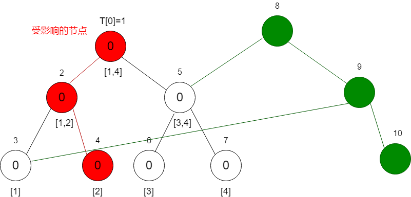
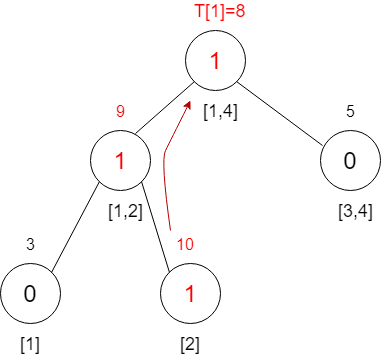
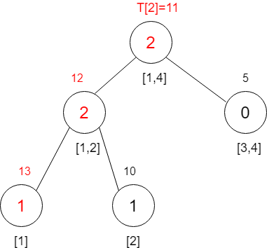
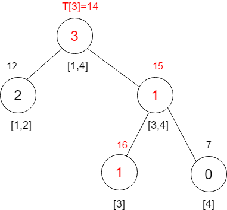
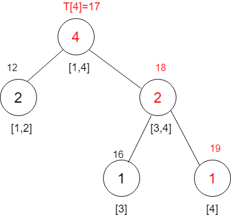
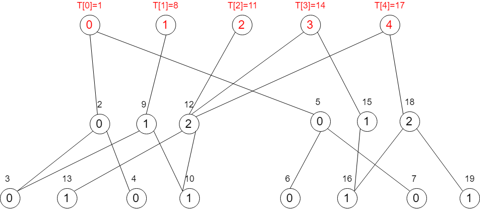
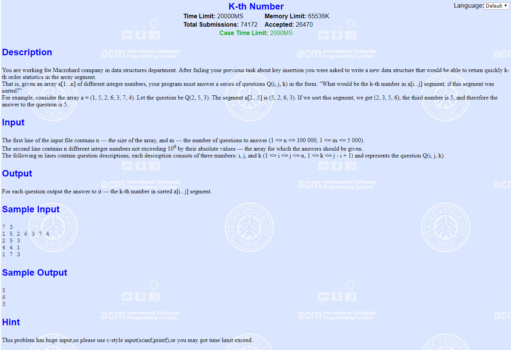

主席树又名可持久化线段树

<!-- more -->

# 简介

传统意义上的主席树就是可持久化线段树，什么叫可持久化呢？就是这棵树啊，**可以记录每一次修改的内容**，换句话说，就是可以访问这棵树的历史记录。

# 常见应用

- 区间/树上路径第 K 大
- 区间不同数的个数

**很多问题如果用线段树处理的话需要采用离线思想，若用主席树则可直接在线处理。故很多时候离线线段树求解可以转化为在线主席树求解。**

注意，主席树本质就是线段树，变化就在其实现可持久化，后一刻可以参考前一刻的状态，二者共同部分很多**。一颗线段树的节点维护的是当前节点对应区间的信息，倘若每次区间都不一样，就会给处理带来一些困难**。有时可以直接细分区间然后合并，此种情况线段树可以直接搞定；但有时无法通过直接划分区间来求解，如频繁询问区间第k小元素，当然，此问题有比较特殊的数据结构-划分树。其实还有一个叫做归并树，是根据归并排序实现的，每个节点保存的是该区间归并排序后的序列，因此，时间、空间复杂度都及其高， 所以一般不推荐去用。当然，主席树也是可以解决的。

# 结构

由若干棵线段树组成（若是权值线段树通常需先对数据离散化），按照输入顺序，每插入一个数保存一份当前版本的线段树。也就是说，**对于 n 个数的输入数据，它会保存 n 棵线段树**。

# 建树过程

下面我们以求区间第 K 大的实例来讲解一下如何建立主席树。

**比如有4个数500 30 6000 9432424，求区间$[2,4]$第2小的数。**

我们可以对区间离散化，离散化变成2 1 3 4

> 离散化：当数据只与它们之间的相对大小有关，而与具体是多少无关时，可以进行离散化。

主席树就是很多线段树的总体，而这些线段树就是按给定序列的所有前缀建立的。所以我们定义：

```
T[i]表示第i棵线段树的根节点编号，L[i]表示节点i的左子节点编号，R[i]表示节点i的右子节点编号，sum[i]表示节点i对应区间中数的个数。 
```

接着，从T[0]开始建立空树，之后依次加入第i个数建立T[i]。 

**注意，如果我们直接以序列的所有前缀建立线段树肯定会MLE，这里主席树最精妙的地方就出来了。我们建立的这些线段树的结构，维护的区间是相同的，主席树充分利用了这些线段树中的相同部分，大大减少了空间消耗，达到优化目的。**

---

按照新数组建立权值线段树，初始为空


**图中每个节点上面为节点编号，节点下面为对应区间，节点中数为区间中含有的数的个数**

---

接下来我们需要按照输入顺序依次插入数据，首先插入2



**我们知道，更新一个叶节点只会影响根节点到该叶节点的一条路径，故只需修改该路径上的信息即可，那么其他的部分就可以共用，不同的部分只需要新建节点即可**

因为上一颗树的最大节点编号为7，所以这颗根节点编号为8。

因为要插入数据为2，根据线段树特点，共三个节点受到影响，受到影响的节点则重新创建节点，那么对应的编号也会变，如上图的编号为9和10的节点，其他节点没有影响的话则继续用上一个节点的信息，不需要改变。

精简后的树如下面所示




*省略部分节点信息*

---

接着插入1



---

插入3



---

插入4



---

下面为所有线段树组合成主席树




从图中应该可以看出主席树是怎么充分利用这些线段树的相同结构来减少空间消耗的。当要新建一个线段树时最多只需要新增$log2n$个节点，相当于只更新了一条链，其它节点与它的前一个线段树公用。

至此，主席树建树完成，时间复杂度$O(nlog2n)$。

# 查找

建完主席树后我们看看它是怎么查找区间$[2,4]$第2小的数的。 

T[i]表示处理完前i个数之后所形成的线段树，即具有了前缀和的性质，那么$T[r] - T[l-1]$即表示处理的$[l, r]$区间。当要查询区间$[1,3]$的时候，我们只要将T[3] 和T[0]节点相减即可得到要处理的线段树

这样我们得到区间$[l, r]$的数要查询第k大就很容易了，设左节点中存的个数为cnt，当$k<=cnt$时，我们直接查询左儿子中第k小的数即可，如果$k>cnt$，我们只要去查右儿子中第$k-cnt$小的数即可，这边是一道很简单的线段树了。

*离散化的过程已经排序，所以上面的查找方法类似于二分查找*

# [POJ2104 K-th Number](http://poj.org/problem?id=2104)



题目大意：

就是很简单的给出一个长为n的序列a，然后给出m个询问，每次给出三个数x,y,k，然后需要我们求出在序列a的区间$[x,y]$中，第k大的数是哪个。


```c++
/*
Problem: 2104		User: heigua
Memory: 22072K		Time: 1250MS
Language: C++		Result: Accepted
2019-07-15 02:47:22
*/
#include <cstdio>
#include <algorithm>
using namespace std;

const int MAXN = 100001;

// 本代码中所有数据均按从下标 1 开始存放

// 主席树中的线段树结点，sum 表示此区间内元素个数
struct node {
    int sum, l, r;
} hjt[MAXN*40];

int a[MAXN], sorted[MAXN], num;    // sorted: 离散化后的数组 num: 离散化后的数组长度
int root[MAXN], cnt;    // root: 主席树中用来保存每棵线段树树根的数组 cnt: 线段树结点数（用于数组方式动态开点）

// 查找离散化之后的下标
int GetIdx(int v) {
    return lower_bound(sorted+1, sorted+1+num, v) - sorted;
}

// 初始化
void Init() {
    cnt = 0;
}

// 创建结点
inline int CreateNode(int sum, int l, int r) {
    int idx = ++cnt;
    hjt[idx].sum = sum;
    hjt[idx].l = l;
    hjt[idx].r = r;

    return idx;
}

// 新建一棵线段树，只沿更新路径新建出较上个版本有修改的结点
// 调用参数
// root: 插入后新生成的线段树的根结点会赋值到 root 中存储
// pre_rt: 上一棵线段树的根
// pos: 本次要插入的数在线段树中的位置
// l, r: 递归参数。默认填写 1, num
void Insert(int &root, int pre_rt, int pos, int l, int r) {
    // 动态创建结点，直接根据上一个版本复制对应的结点，sum+1
    root = CreateNode(hjt[pre_rt].sum+1, hjt[pre_rt].l, hjt[pre_rt].r);
    if(l == r) return;
    int m = (l+r) >> 1;
    if(pos <= m)
        Insert(hjt[root].l, hjt[pre_rt].l, pos, l, m);
    else Insert(hjt[root].r, hjt[pre_rt].r, pos, m+1, r);
}

// 本函数适用于查询区间 [l, r] 中的第 k 小。通常需要自行变通
// 调用参数
// s, e: 要查询区间所需的两个线段树的根，如要查询区间 [l, r]，则传入 root[l-1], root[r]
// k: 要查询区间第几小
// l, r: 递归参数。默认填写 1, num
int Query(int s, int e, int k, int l, int r) {
    if(l == r) return l;
    int m = (l+r) >> 1;
    int sum = hjt[hjt[e].l].sum - hjt[hjt[s].l].sum;    // 计算左子树的元素数量
    if(k <= sum)    // 如果 k <= sum，则 k 在左子树，否则在右子树
        return Query(hjt[s].l, hjt[e].l, k, l, m);
    else return Query(hjt[s].r, hjt[e].r, k-sum, m+1, r);
}

int main()
{
    int n, m, l, r, k;
    while(~ scanf("%d %d", &n, &m)) {
        Init();
        for(int i=1; i<=n; ++i) {
            scanf("%d", &a[i]);
            sorted[i] = a[i];
        }
        sort(sorted+1, sorted+1+n);    // 按值排序
        num = unique(sorted+1, sorted+1+n) - (sorted+1);    // 去重，返回去重后的元素数量
        for(int i=1; i<=n; ++i) {    // 按顺序插入，建立 n 棵权值线段树
            Insert(root[i], root[i-1], GetIdx(a[i]), 1, num);
        }
        while(m--) {
            scanf("%d %d %d", &l, &r, &k);
            printf("%d\n", sorted[Query(root[l-1], root[r], k, 1, num)]);
        }
    }
    
    return 0;
}
```


参考：

[【蒟蒻数据结构】主席树 - 蒟蒻のBLOG](https://www.jvruo.com/archives/171/)

[算法有点甜之主席树 - bLue's blog](https://dreamer.blue/blog/post/2018/03/01/aiabs_hjt.dream)

[主席树（静态） 图文讲解让你一次就懂 hdu2665为例](http://www.fdlly.com/p/182447363.html)

[树状结构之主席树 - 殇雪 - 博客园](https://www.cnblogs.com/zyf0163/p/4749042.html)