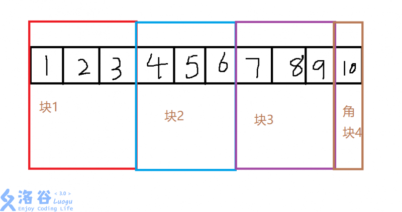
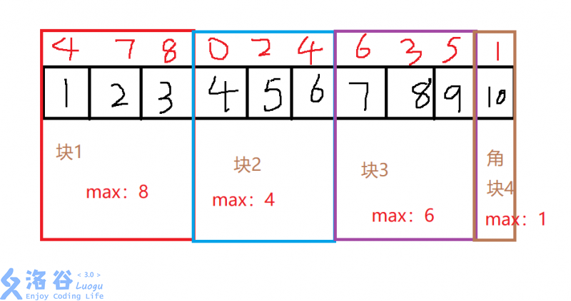
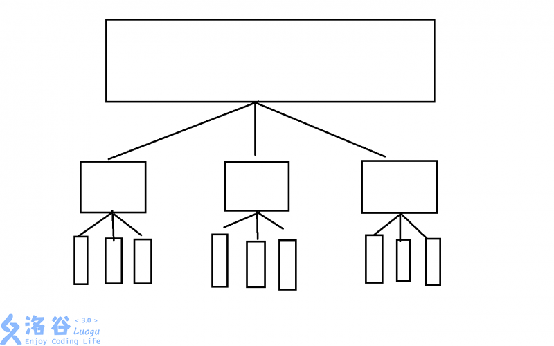
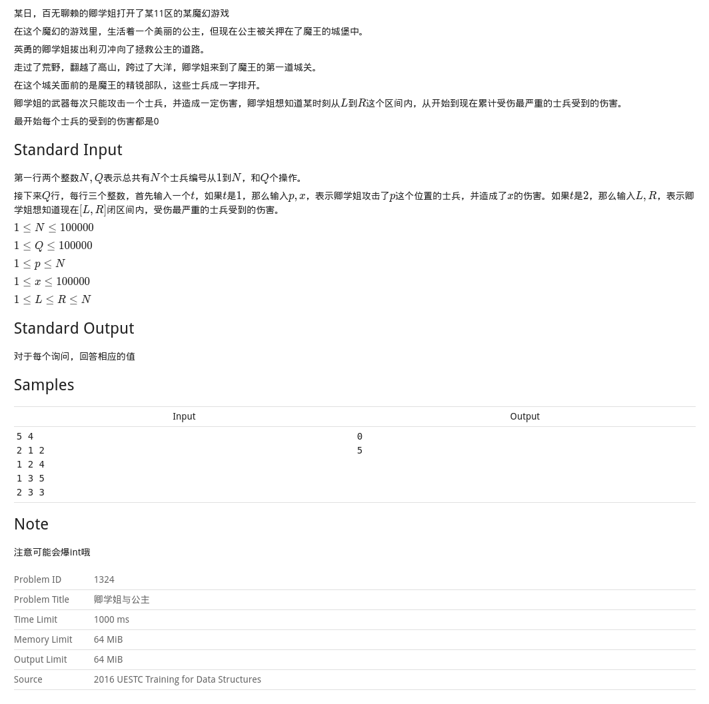

分块算法

<!-- more -->

# 简述

- 其实，分块是一种思想，而不是一种数据结构，**整体维护，局部暴力**

- 分块算法实质上是一种是通过分成多块后在每块上打标记以实现快速区间修改，区间查询的一种算法。其均摊时间复杂度为$O(\sqrt{n})$，在$n=10^5$时，由于常数小，跟线段树可能差不多。

- 分块算法相较于各种树形数据结构，具有简便易写，方便调试等多种优点。在同等数据规模下，如 1e5 ，其时间效率并不会低太多，在考试时反而是一种有力的得分方法。

# 基本操作及性质

为了使得其有着最稳定的时间复杂度，我们经常把一个长度为 n 的序列分为 $\sqrt{n}$个大小为$\sqrt{n}$的块，如果 n 不是完全平方数，则序列最右端会多出一个角块（其实是根据均值不等式，这样划分是时间复杂度最小的）

如下图，就是一种序列的分块：




该长度为 10 的序列被分为了 4 块，前三块的大小为 $\sqrt{10}$的近似值 3 ，最后一个角块大小为 1

---

而我们要记录的一个值，就是每个序号代表的数，属于哪一块

如上图， 1,2,3就属于第一块， 4,5,6就属于第二块，7,8,9就属于第三块，10 就属于第四块

可以得到获取每一个序号的所在块的代码是：

```c++
int n;//总个数
int block=sqrt(n);//每一块大小
for(int i=1;i<=n;i++)
{
    //belong[i]：第i个数所在块的编号
    belong[i]=(i-1)/block+1;
}
```

# 区间最值

但是，如何用分块来维护区间最值？

我们举个例子:

给定一个长的为n数列，求出任意区间$[l,r]$的最大值$(1<=l,r<=n)(l<=r)$



**我们现在给每个点上加了一个权值，每个块维护一下块内最大值**

当我们查询任意一个区间$ [l,r]$时：

- 如果$l$所在的块与$r$所在的块相同，如$[1,2]$，则直接暴力查询即可，时间复杂度  $O(\sqrt{n})$（每块有 $\sqrt{n}$个数，角块除外）

- 若其不在一个块但是块是相邻的，一样是暴力查询，时间复杂度$O(\sqrt{n})$
- 若其块不相邻，如$[1,10]$，我们先处理两边的边块角块，先暴力查询$1$和$10$所在的块内最大值，最后直接查询中间块内最大值即可，时间复杂度$O(\sqrt{n})$（因为我们已经统计了个每个块的最大值了，所以查询中间块的最大值即是$O(\sqrt{n})$，最终加起来还是$O(\sqrt{n})$）

# 区间修改

对于整块修改，我们打个加法标记，即当前块增加了多少，最大值相应的就增加了多少

所以总时间复杂度也是$O(\sqrt{n})$

# 分块的实质

分块其实是一种树形结构，它是一种只有三层的树，形态如下：



第一层为整个序列，第二层为$\sqrt{n}$个大小为$\sqrt{n}$的序列(近似)，第三层为$n$个大小为$1$的序列

# 分块与树状数组，线段树对比

树状数组和线段树的效率均为$O(nlogn)$，树状数组常数较小，分块效率为$O(n\sqrt{n})$

一般树状数组常数优秀的话可以承受到1e6的数据范围

线段树可以承受5e5的数据范围

分块可以承受5e4的数据范围，常数优秀的话可以承受1e5的数据范围

树状数组最难理解，代码实现最简单

线段树较易理解，代码实现最复杂，常数较之树状数组会比较大

分块易理解，代码实现难度适中，复杂度较高

所以请根据实际情况选择不同的算法

# 分块基本模板

```c++
const int MAXN = 1E5;
/**
 * num:分块个数
 * belong[i]:i属于哪一块
 * L[i]:i这块的左端点位置
 * R[i]:右端点位置
 */
int num, belong[MAXN], L[MAXN], R[MAXN];

//对序列进行分块
void build()
{
    int block = sqrt(n);
    num = n / block;
    //不是完全数，加一个角块
    if(n % block)
        num++;
    for(int i = 1; i <= num; i++)
    {
        L[i] = (i-1)*block+1;
        R[i] = i*block;
    }
    //处理多出来那个，角块
    R[num] = n;
    for(int i = 1; i <= n; i++)
        belong[i] = (i-1)/block+1;
}
```

# [UESTC 1324](https://acm.uestc.edu.cn/problem/qing-xue-jie-yu-gong-zhu/description)



```c++
/*
Problem:卿学姐与公主
Time:2019-06-16 21:15:57
Lang:GNU G++
Case:12 / 12
*/
#include <bits/stdc++.h>
using namespace std;

const int MAXN = 1e5+7;
/**
 * num:分块个数
 * belong[i]:i属于哪一块
 * L[i]:第i块的左端点位置
 * R[i]:右端点位置
 * Max[i]:第i块中的最大值
 * arr[i]: 第i个士兵受到的伤害
 */
int block, belong[MAXN], num, L[MAXN], R[MAXN], n, q;
long long Max[MAXN] = {0}, arr[MAXN] = {0};

//对序列进行分块
void build()
{
    block = sqrt(n);
    num = n / block;
    if(n % block)
        num++;
    for(int i = 1; i <= num; i++)
    {
        L[i] = (i-1) * block + 1;
        R[i] = i * block;
    }
    R[num] = n;
    for(int i = 1; i <= n; i++)
        belong[i] = (i-1) / block + 1;
    //初始化每一块中的最大值
    for(int i = 1; i <= num; i++)
        for(int j = L[i]; j <= R[i]; j++)
            Max[i] = max(Max[i], arr[j]);

}

void update(int x, int y)
{
    arr[x] += y;
    //更新x所在块的最大值
    Max[belong[x]] = max(Max[belong[x]], arr[x]);
}

long long ask(int x, int y)
{
    long long ans = 0;
    //在同一块的话直接暴力
    if(belong[x] == belong[y])
    {
        for(int i = x; i <= y; i++)
            ans = max(arr[i], ans);
        return ans;
    }
    //处理左端点所在块的最大值
    for(int i = x; i <= R[belong[x]]; i++)
        ans = max(ans, arr[i]);
    //处理除左端点所在块以外的块
    for(int i = belong[x]+1; i < belong[y]; i++)
        ans = max(ans, Max[i]);
    for(int i = L[belong[y]]; i <= y; i++)
        ans = max(ans, arr[i]);
    return ans;
}

int main()
{
    scanf("%d%d", &n, &q);
    build();
    while(q--)
    {
        int op, x, y;
        scanf("%d%d%d", &op, &x, &y);
        if(op == 1)
            update(x, y);
        else
            printf("%lld\n", ask(x, y));
    }
    return 0;
}
```


参考：[浅谈基础根号算法——分块](https://www.luogu.org/blog/48265/qian-tan-ji-chu-gen-hao-suan-fa-fen-kuai)

[OIWIKI-分块思想](https://oi-wiki.org/ds/square-root-decomposition/)

[分块入门与分块的经典应用](https://www.cnblogs.com/henry-1202/p/10124856.html)