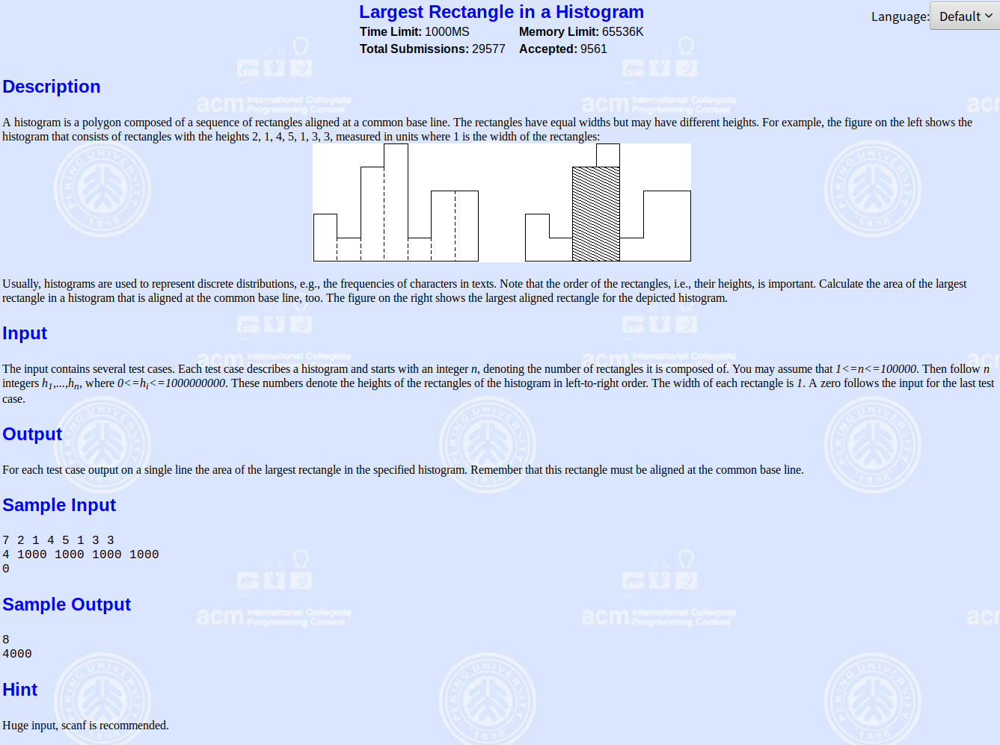

单调栈及poj2559

<!-- more -->

# 单调栈

什么是单调栈？顾名思义，单调栈首先是一个栈，并且栈内的元素的大小按照他们所在栈内的位置，满足一定的单调性。

比如有一数组{1,3,232,23,24,3324,-1}，维护其单调递减栈，数组左边为栈顶

首先，栈为空，入栈[1]

到下一个元素3，因为3>1，所以入栈，此时栈[3,1]

接着下一个元素232，因为232>3，所以入栈，此时栈[232,3,1]

接着下一个元素23，因为232<23，所以232出栈，此时栈[3,1]，因为3<23，所以入栈，此时栈[23,3,1]

接着下一个元素3324，因为3324>23，所以入栈，此时栈[3324,23,3,1]

接着下一个元素-1，因为3324>-1，所以出栈，此时栈[23,3,1]，因为23>-1，所以出栈，此时栈[3,1]，因为3>-1，出栈，此时栈[1]，因为1>-1，出栈，此时栈为空，将-1入栈，此时栈[-1]

# [模板题--poj2559](http://poj.org/problem?id=2559)



## 解析

参考：[https://www.zybuluo.com/Chilling/note/633014](https://www.zybuluo.com/Chilling/note/633014)

题意：给出几个连续的宽为1的木板的高度，求木板构成矩形的最大面积。

将木板的长和宽（h，w）压入栈中，若下一个木板的高度大于等于当前栈顶的，那么依次弹出栈中的木板，并且累加他们的宽度，更新最大面积，贪心选择当前最高矩形能连续的位置

举例：

(x，y)为一结构体，x表示矩形的高，y为矩形的宽。 
给出的例子：2，1，4，5，1，3，3，数组左边为栈顶

1. 入栈： `(2,1)`
2. 下一个高度为1，但是栈顶高度为2，大于1，说明高度为2的矩形不能延续到当前矩形，那么删除(2，1)，累加宽度，并且更新最大面积2，（1，2）入栈；`(1,2)`
3. (4，1)入栈：`(4,1)(1,2)`

4. (5，1)入栈：`(5,1)(4,1)(1,2)`

5. 下一个高度为1，但是栈顶高度为5，大于1，那么删除(5，1)，更新最大矩形面积为5，把1累加到下一个元素，得到(4，2)，仍然大于1，删除(4，2)，更新最大矩形面积为8，把2累加到下一个元素，得到(1，4)，面积为4小于8，不必更新，删除(1，4)，把4累加到当前准备进栈的元素，(1，5)进栈
6. (3，1)进栈：`(3,1)(1,5)`
7. 下一个高度为3，但是栈顶高度也为3，删除(3，1)不必更新，把1累加到当前准备进栈的元素，(3，2)进栈: `(3,2)(1,5)`
8. 栈非空时，依次出栈；首先(3，2)出栈，不必更新，把2累加到下一个元素，当前栈为(1，7)，(1，7)出栈，不必更新。 
   栈空，结束。 
   最后的答案就是8


```c++
/*
c++: 2812K	375MS
2019-04-29 20:57:30
*/
#include<cstdio>
#include<stack>
#include <algorithm>
typedef long long LL;
using namespace std;
struct node
{
    LL h,w; //矩形的高，宽
}a[100005];

int main()
{
    LL n;
    while(scanf("%lld",&n) && n)
    {
        LL ans=0;
        for(int i = 0; i < n; i++)
        {
            scanf("%lld", &a[i].h);
            a[i].w = 1;
        }
        stack<node>q;
        for(int i = 0 ;i < n;i++)
        {
            LL temp = 0;
            //栈不为空&&栈顶的值>=当前元素的值，出栈已经更新面积值
            while(!q.empty() && q.top().h >= a[i].h) 
            {
                LL x = q.top().h*(q.top().w+temp); //计算面积
                ans = max(ans,x);
                temp += q.top().w; //叠加宽
                q.pop();
            }
            node next;
            next.h = a[i].h;
            next.w = 1+temp;
            q.push(next); //元素进栈
        }
                LL temp=0;
        while(!q.empty()) //遍历完所有元素，但是栈还有元素
        {
            LL x = q.top().h*(q.top().w+temp);
            ans = max(ans,x);
            temp += q.top().w;
            q.pop();
        }
        printf("%lld\n",ans);
    }
    return 0;
}

```

