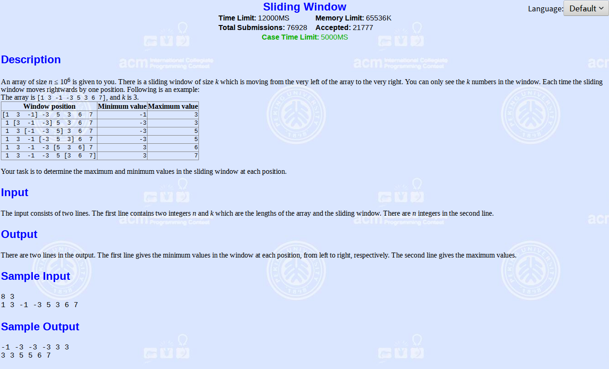
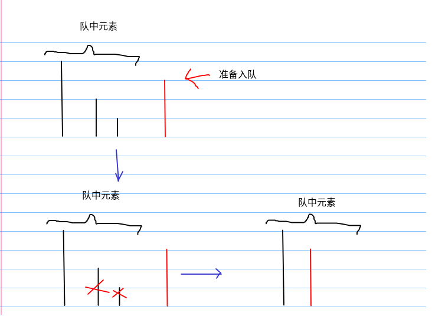
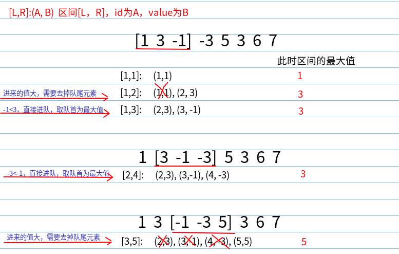
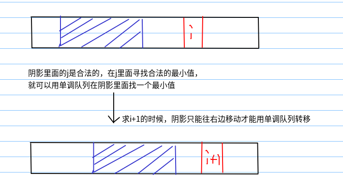
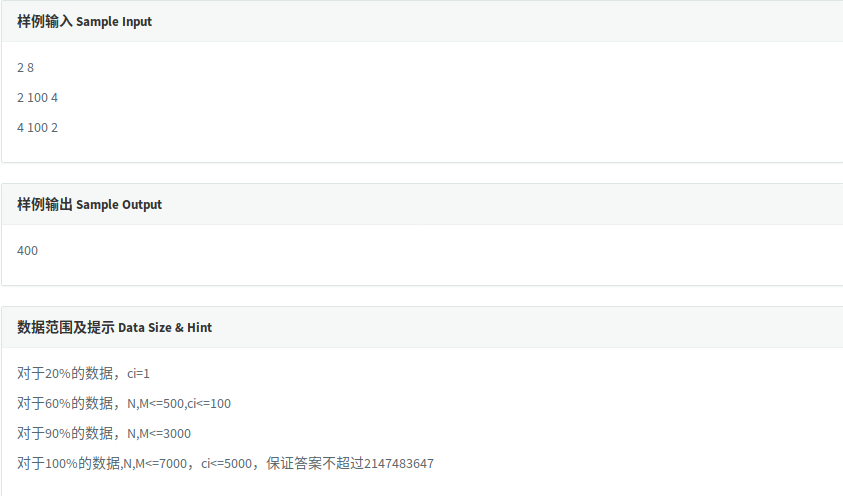

单调队列及其优化dp

<!-- more -->

# 单调队列

**[poj2823--Sliding Window](http://poj.org/problem?id=2823)**



大意：给你一个长度为N的数组，一个长为K的滑动的窗体从最左移至最右端，你只能见到窗口的K个数，每次窗体向右移动一位，你的任务是找出窗体每个时刻中的最大值与最小值

## 优先队列

优先队列能够进行排序，窗口往右一位，就把一个元素放到队列里面，然后每次取队首元素，如果队首元素的id在这个框的范围内的话，那么就取队首，如果不是的话那么就出队，找下一个队首元素，时间复杂度为O(nlogn)

## 对优先队列改良--单调队列O(n)

**基本思想：同样维护队首元素作为答案，去掉多余的元素（维护单调性）**

因为是求最大值，所以维护一个单调递减队列，其队首就是最大值，就是我们想要的答案

|      | L    | L+1    | ...... | R-1    | R      |
| ---- | ---- | ------ | ------ | ------ | ------ |
| 编号 | A[L] | A[L+1] | ...... | A[R-1] | A[R]   |
| 值   | B[L] | B[L+1] | ...... | B[R-1] | B[R+1] |

上面单调**递减**队列满足：

`A[i+1]>A[i]>A[i-1] && B[i-1]>B[i]>B[i+1]（R>i>L）`

单调队列里面的每一个元素一般用一个二元组(id, val)来表示，每次从队尾入队，删除队尾的无用元素，保证编号递增，值递减



如上图，当有一元素A要入队时，为了保证队中的单调性，需要删除队尾两个元素，A才能入队，单调性得到了保证，删除队尾的那两个元素，就是上面说的“无用元素”

---

下面举例是怎么工作的，刚开始只有[1,1]，所以二元组的值为(1,1)，接着扩大区间，第二个元素元素准备入队，此时3要比-1大，所以去掉队尾元素，然后判断队首元素id属不属于当前区间，是的话就取队首为最大值，否则去掉队首，直到满足条件。如果准备入队的元素小于队尾的元素，直接入队，然后判断队首是不是属于当前区间，接着取最大值，不是则去队首。



**每个元素都只会进队和出队一次，故时间复杂度为O(n)**

**本质作用：在运行的过程中能够快速需求前k个或后k个中的最值**

## 实现

参考：[http://zory.coding.me/posts/e1c7.html](http://zory.coding.me/posts/e1c7.html)

单调队列可以用STL的deque实现，也可以手写数组实现。

两种实现效率比较：数组优于deque

**因为系统自带容器不方便而且不易调试，同时，每个数只会进去一次，所以，数组绝对不会爆，空间也是S（N），优于堆或线段树等数据结构**

```c++
/*
C++: 5604K	5360MS
2019-04-28 21:18:27
*/
#include <cstdio>
using namespace std;

const int MAXN = 1E6+10;
struct node
{
    int pos, val; //位置与值的二元组
}q1[MAXN], q2[MAXN];
int arr[MAXN];
int n, m;

void GetMax()
{
    int Front = 1, Back = 0; //队首与队尾
    for(int i = 1; i <= n; i++)
    {
        //队不为空&&队尾元素大于要进队的元素
        while(Back >= Front && q1[Back].val >= arr[i]) 
            Back--; //出队
        //因为那个while循环在刚好满足的条件退出，所以得进一步处理下一个不满足要求的
        Back++;	
        q1[Back].val = arr[i]; //进队
        q1[Back].pos = i;
        while(Back >= Front && q1[Front].pos + m - 1 < i) //判断队首在不在当前区间
            Front++; //去队首
        if(i >= m)
            printf("%d ", q1[Front].val);
    }
}

void GetMin()
{
    int Front = 1, Back = 0;
    for(int i = 1; i <= n; i++)
    {
        while(Back >= Front && q2[Back].val <= arr[i])
            Back--;
        Back++;
        q2[Back].val = arr[i];
        q2[Back].pos = i;
        while(Back >= Front && q2[Front].pos + m - 1 < i)
            Front++;
        if(i >= m)
            printf("%d ", q2[Front].val);
    }
}

int main()
{
    scanf("%d %d", &n, &m);
    for(int i = 1; i <= n; i++)
        scanf("%d", &arr[i]);
    GetMax();
    printf("\n");
    GetMin();
    return 0;
}
```

## 单调队列优化dp

形如的dp

```c++
f[i] = min(f[j] | Low[i] <= j <= Up[i]) + a[i]
```

Low和Up是关于i的单调不下降函数（因为是求min，队首为最小值）

例如下面举例` Low[i] <= j <= Up[i]`为阴影，那么求i+1的时候，阴影的左右端点不能往左移动，这样才能用单调队列求解，因为单调队列一直都是从头处理到尾，如果返回的时间复杂度就可能不是O(logn)了



## 单调队列优化多重背包实例

**[Codevs5249](http://codevs.cn/problem/5429/)**




参考：[https://blog.csdn.net/ylsoi/article/details/80238116](https://blog.csdn.net/ylsoi/article/details/80238116)

题意：

你有一个容量为M的背包，和N种物品。 
每种物品都有三个属性，vi，wi，与ci，分别表示这种物品的体积、价值和件数。 
你的任务是，从这些所给物品中，选出若干件，其体积之和不能超过背包容量，并且使所选物品的权值的和最大。

解析：

朴素的方法当然是先枚举物品再枚举体积最后再枚举个数，但是这样的时间复杂度太高，接受不了，所以可以考虑用单调队列优化DP。发现单调队列维护的区间一定是一段连续的区间，但是由于v[i]的限制，如果还按照原来的顺序枚举，这样我们的决策点将不满足连续，而是离散的，所以我们要想办法解决这个问题才可以用单调队列优化。发现在模v[i]的同一个剩余类下的所有体积的决策点都是连续的（虽然看起来是离散，但是是连续的离散），可以用单调队列维护，所以我们先按照剩余类分类，对于每一个剩余类用一个单调队列维护，这样时间复杂度就只有O(nm)了。

```c++
/*
 971 ms
 2019-04-28 22:33:41
*/
#include<string>
#include<cstdio>
using namespace std;
int const N=1e4;

int c,w,num,n,m,i,j,k,head,tail;
int a[N],b[N],f[N],q[N];

int main()
{
    scanf("%d %d",&n, &m);
    for(i=0;i<n;i++)
    {
        scanf("%d %d %d",&c, &w, &num);
        if(m/c<num) //取最小值 
            num=m/c;
        for(k=0;k<c;k++) //分成c份 
        {
            head=tail=0;
            for(j=0;j<=(m-k)/c;j++)
            {
                int x=j;
                int y=f[j*c+k]-j*w; //将f[j*c+k]-j*w入队 
                while(head<tail && y>=b[tail-1])
                    tail--;
                a[tail]=x; //记录下标 
                b[tail++]=y; //记录dp值 
                while(a[head]<j-num) //如果超出了范围 
                    head++;
                f[j*c+k]=b[head]+j*w;
            }
        }
    }
    printf("%d\n",f[m]);
return 0;
}
```

