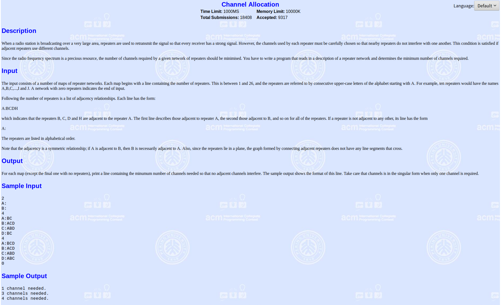

洛谷P2819图的m着色问题, POJ 1129 Channel Allocation

<!-- more -->

# [模板题--洛谷P2819图的m着色问题](https://www.luogu.org/problemnew/show/P2819)


```c++
/*
代码 C++11，0.77KB
提交时间 2019-04-04 15:54:31
耗时/内存
277ms, 888KB
*/
#include <cstdio>
using namespace std;
const int MAXN = 1E3;
bool gra[MAXN][MAXN] = {false}; //判断两个点是否连通
int color[MAXN] = {0}; //存每个点已经涂成的颜色,值为0则是没有被涂色

int n, k, m, e1, e2, ans = 0;

bool check(int num)
{
    for(int i = 1; i <= num; i++)
    {
        //当两个图连通且颜色一样就冲突
        if(gra[i][num] == true && color[i] == color[num])
            return false;
    }
    return true;
}

void dfs(int num)
{
    if(num > n) //搜完所有顶点
    {
        ans++;
        return;
    }
    for(int i = 1; i <= m; i++) //遍历所有颜色
    {
        color[num] = i; //给第num个顶点上第i个颜色
        if(check(num))
            dfs(num+1); //涂下一个
        else
            color[num] = 0; //如果冲突,则回溯,也就是清除涂色状态回到上一个点
    }
}
int main()
{
    scanf("%d %d %d", &n, &k, &m);
    for(int i = 1; i <= k; i++)
    {
        scanf("%d %d", &e1, &e2);
        gra[e1][e2] = true;
        gra[e2][e1] = true;
    }
    dfs(1); //从第一个点开始
    printf("%d\n", ans);
    return 0;
}
```

# [POJ1129](http://poj.org/problem?id=1129)

## 题目



## 解析

参考:[https://blog.csdn.net/lyy289065406/article/details/6647986](https://blog.csdn.net/lyy289065406/article/details/6647986)

题意:

当一个广播电台在一个非常大的地区，广播站会用中继器来转播信号以使得每一个接收器都能接收到一个强烈的信号。然而，每个中继器必须慎重选择使用，使相邻的中继器不互相干扰。如果相邻的中继器使用不同的频道，那么就不会相互干扰。

由于无线电频道是一有限的，一个给定的网络所需的中继频道数目应减至最低。编写一个程序，读取一个中继网络，然后求出需要的最低的不同频道数。

**即一个有N个节点的无向图，要求对每个节点进行染色，使得相邻两个节点颜色都不同，问最少需要多少种颜色？**

### 暴力搜索

```c++
/*
2019-04-04 16:54:23
*/
#include <cstdio>
#include <cstring>
using namespace std;
const int MAXN = 1E3;
bool gra[MAXN][MAXN] = {false};
int color[MAXN] = {0};

int n, ans = 0;
bool Find = false;


bool check(int num)
{
    for(int i = 0; i < num; i++)
    {
        if(gra[i][num] == true && color[i] == color[num])
            return false;
    }
    return true;
}

void dfs(int num, int cnt) //当前搜索到下标为id的点，此时总共用的颜色数为cnt
{
    if(Find)
        return;
    if(num >= n)
    {
        Find = true;
        return;
    }
    for(int i = 1; i <= cnt; i++)
    {

        color[num] = i;
        if(check(num))
            dfs(num+1, cnt);
        else
            color[num] = 0;
    }
    if(!Find) //当用cnt种颜色无法完成时，则增加一种颜色进行着色
    {
        ans++;
        dfs(num, cnt+1);
    }
}

int main()
{
    char s[MAXN];
    while(scanf("%d", &n) != EOF && n)
    {
        getchar();
        memset(gra, false, sizeof(gra));
        memset(color, 0, sizeof(color));
        for(int i = 0; i < n; i++)
        {
            scanf("%s", s);
            int e1 = s[0]-'A';
            for(int j = 2; s[j] != '\0'; j++)
            {
                int e2 = s[j]-'A';
                gra[e1][e2] = gra[e2][e1] = true;
            }
        }
        ans = 1;
        Find = false;
        dfs(0,1);
        if (ans == 1)
            printf ("1 channel needed.\n");
        else
            printf ("%d channels needed.\n", ans);
    }
    return 0;
}
```

### 四色定理剪枝

**四色问题**的内容是:任何一张地图只用四种颜色就能使具有共同边界的国家着上不同的颜色。”也就是说在不引起混淆的情况下一张地图只需四种颜色来标记就行。


**四色定理的“相邻”是指两块多边形地区“至少一条边重合”才为之相邻**

**“至少一条边重合”同时也隐含了“任意边（线段）不正规相交**

本题的相邻是“两点有边连接，但任意两边不交叉（正规相交）”，这种“相邻”其实就是四色定理的“相邻”。

```c++
#include <cstdio>
#include <cstring>
using namespace std;
const int MAXN = 1E3;
bool gra[MAXN][MAXN] = {false};
int color[MAXN] = {0};

int n, ans = 0;
bool Find = false;

bool check(int num)
{
    for(int i = 0; i < num; i++)
    {
        if(gra[i][num] == true && color[i] == color[num])
            return false;
    }
    return true;
}

void dfs(int num, int cnt)
{

    if(Find)
        return;
    if(num >= n)
    {
        Find = true;
        return;
    }
    for(int i = 1; i <= cnt; i++)
    {

        color[num] = i;
        if(check(num))
            dfs(num+1, cnt);
        else
            color[num] = 0;
    }
    if(!Find)
    {
        ans++;
        if(cnt+1 == 4) //四色定理
        {
            ans = 4;
            return;
        }
        else
            dfs(num, cnt+1);
    }
}

int main()
{
    char s[MAXN];
    while(scanf("%d", &n) != EOF && n)
    {
        getchar();
        memset(gra, false, sizeof(gra));
        memset(color, 0, sizeof(color));
        for(int i = 0; i < n; i++)
        {
            scanf("%s", s);
            int e1 = s[0]-'A';
            for(int j = 2; s[j] != '\0'; j++)
            {
                int e2 = s[j]-'A';
                gra[e1][e2] = gra[e2][e1] = true;
            }
        }
        ans = 1;
        Find = false;
        dfs(0,1);
        if (ans == 1)
            printf ("1 channel needed.\n");
        else
            printf ("%d channels needed.\n", ans);
    }
    return 0;
}
```

# [蓝桥杯历届试题分考场](http://lx.lanqiao.cn/problem.page?gpid=T457)

## 题目


## 解析

此题是一道经典的图的染色问题，等同于：对图经行染色，且相邻的顶点不能染同样的颜色，问至少需要多少种不同的颜色
参考:[https://www.cnblogs.com/looeyWei/p/10439834.html](https://www.cnblogs.com/looeyWei/p/10439834.html)
[https://blog.csdn.net/memeda1141/article/details/80301201](https://blog.csdn.net/memeda1141/article/details/80301201)

```c++
#include <cstdio>
const int MAXN = 1E3;
bool gra[MAXN][MAXN] = {false}; //gra[i][j]=1表示i和j认识，否则不认识
int room[MAXN][MAXN] = {0}; //room[i][j]=x 表示第i个房间第j个人是编号为x的学生
int room_num[MAXN] = {0};   //room_num[i]=k  表示第i个房间有k个人

int n, m, e1, e2, ans = 1e9;

void dfs(int num, int cnt) //num表示当前学生的编号，cnt表示用掉房间的数量
{
    if(cnt >= ans) //如果当前用掉房间的数量大于历史用掉的最小数量，返回
        return;
    if(num > n) //如果学生已经安排完了，取最优值，并返回 
    {
        if(ans > cnt)
            ans = cnt;
        return;
    }
    for(int i = 1; i <= cnt; i++) //遍历所有房间
    {
        int len = room_num[i]; //第i个房间的有多少人
        int k = 0;
        for(int j = 1; j <= len; j++) //遍历当前房间的所有学生
        {
            if(!gra[num][room[i][j]]) //如果学生num与学生room[i][j]没有关联，k++;
                k++;
        }
        if(k == len)  //如果num与当前房间所有的人都没有关联
        {
            room[i][++room_num[i]] = num; //那么就把num放进这个房间里
            dfs(num+1, cnt); //当前学生已经被安排，dfs安排下一个学生
            room_num[i]--; //递归返回之后把这个同学在从这个教室分走，分到下几个教室看看
        }
    }
    //如果全部教室都存在num认识的同学，那么就把这个同学新开个教室
    room[cnt+1][++room_num[cnt+1]] = num; 
    dfs(num+1, cnt+1); //递归下一个同学并且当前的教室数目+1
    room_num[cnt+1]--; //返回后移除这个同学看下上一个同学有没有其他的选择
}
int main()
{
    scanf("%d%d", &n, &m);
    for(int i = 1; i <= m; i++)
    {
        scanf("%d%d", &e1, &e2);
        gra[e1][e2] = gra[e2][e1] = true;
    }
    dfs(1, 0);
    printf("%d", ans);
    return 0;
}

```

