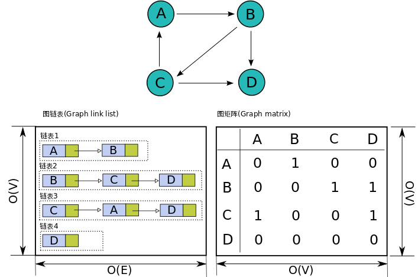

邻接矩阵，邻接表，链式向前星

<!-- more -->

参考：

[ACM图论之存图方式](http://jzqt.github.io/2015/07/21/ACM%E5%9B%BE%E8%AE%BA%E4%B9%8B%E5%AD%98%E5%9B%BE%E6%96%B9%E5%BC%8F/)

# 邻接矩阵

邻接矩阵是三种存图方式中最简单也最为暴力的一种存图方式了。

## 存图思想

使用一个矩阵来描述一个图，对于矩阵的第i行第j列的值，表示编号为i的顶点到编号为j的顶点的权值

## 代码实现

对于邻接矩阵来说，它的代码实现都十分简单，二维数组就可以了。

```c++
#include <cstring>

//最大顶点数
const int MAXV = 1e3;
//邻接矩阵,Map[i][j]:顶点i到顶点j的权值
int Map[MAXV][MAXV];
memset(Map, 0, sizeof(Map));

// 增加边
// 新增顶点`i`到顶点`j`的边，权值为`w`
Map[i][j] = w;

// 删除边
// 删除顶点`i`到顶点`j`的边
Map[i][j] = 0;

// 查询边
// 查询顶点`i`到顶点`j`的边权

Map[i][j];
```

## 优点

使用邻接矩阵来进行建图存图有以下优点

- **简单易学**

这个肯定不用多说，哪怕是没学过线性代数的童鞋也很容易理解这样的存图方式。

- **代码易写，简单好操作**

上面的代码实现已经展示了要定义这个数据结构以及实现初始化，增加删除边等操作有多么的简单。

- **对已确定的边进行操作，效率高**

确定边（已知两顶点编号）要进行增加或删除边（或者说更改边权）以及查询边权等操作，时间复杂度为O(1)。

- **易处理重边**

你可以随时覆盖掉重边，可以自己实现存储最新的边，权值最大的边或权值最小的边等。
当然，如果你非要使用邻接矩阵存图还要存重边也不是不可以。

## 缺点

邻接矩阵存图虽然简单优雅，但是它的一些缺点却几乎是致命的。

- **过高的空间复杂度**

对于顶点数V，邻接矩阵存图的空间复杂度高达`O(V^2)`，顶点数上了一万可以不用考虑这种存图方式了。
对于稀疏图来说，邻接矩阵存图内存浪费太严重，这也是邻接矩阵存图在ACM题目中十分罕见的根本原因。

- **对于不确定边的查询效率一般**

比如，我找个编号为1出发的第一条边我还要一条条边判断是否存在（权值是否为0）

# 邻接表

邻接表在三种常用的存图方式中属于较为中庸和普遍的存图方式了，缺点不致命，优点不明显。

## 存图思想

**邻接矩阵**对于每个顶点使用**定长的数组**来存储以该点出发的边的情况。第i个数组的第j个值存储的是从顶点i到顶点j的边的权值。

而**邻接表**则是对于每个顶点使用**不定长的链表**来存储以该点出发的边的情况。**因此对于第i个链表的第j个值实际上存储的是从编号为i的顶点出发的第j条边的情况**。

**一般来说，如果有边权的话，邻接表的链表存储的是一个结构体，这个结构体存储该边的终点以及边权**



## 代码实现

在ACM题目中，动态的数据结构一般是不被推荐的，因为动态开辟内存比较消耗时间，且写起来复杂容易出错。
大部分情况我们使用**C++STL里的vector**作为链表来实现图的邻接表。

```c++
#include <vector>
using namespace std;

// vector实现的邻接表的定义
// 不考虑边权，存储类型为int型
vector<int> e[V];

// 邻接表的初始化操作
// 将起点为`i`的边链表全部清空
e[i].clear();

// 增加边
// 新增顶点`i`到顶点`j`的边
e[i].push_back(j);

// 查询边
e[i][0];    // 查询以`i`为起点的第一条边i->e[i][0]
for (int j=0; j<(int)e[i].size(); ++j) {
    if (e[i][j] == k) {     // 查询边`i->k`
        // do something.
    }
}
```

## 优点

- **较为简单易学**

相比邻接矩阵，无非是数组转链表加上存储值的意义不同而已，不需要转太大的弯。

- **代码易写，不复杂**

代码实现已经演示过了，较简单，不容易写错。

- **内存利用率较高**

对于顶点数V与边数E，空间复杂度为O(V+E)。能较好处理稀疏图的存储。

- **对不确定边的操作方便效率也不错**

比如，要遍历从某点出发的所有边，不会像邻接矩阵一样可能会遍历到不存在的边。

## 缺点

- **重边不好处理**

判重比较麻烦，还要遍历已有的边，不能直接判断。
一般情况下使用邻接表存图是会存储重边的，不会做重边的判断。
所以如果要解决重边的影响一般不在存边的情况下做文章。

- **对确定边的操作效率不高**

比如对于给定i->j的边要进行查询或修改等操作只有通过遍历这种方式找到了。

# 链式向前星

链式前向星是前向星的升级版，因为它可以完美代替前向星，所以就跳过前向星的学习，直接学习链式前向星。

## 存图思想

链式前向星的本质其实就是用数组模拟链表的邻接表。

这种存图方式的数据结构主要是**边集数组**，顾名思义，**图的边是用数组来存储的。**
当然想要完美表示图结构，光有一个边集数组还不够，还要有一个数组存储指向**每一个点的第一条边的“指针”。**
而每一条边都需要存储接下来一条边的“指针”，这样就能够像类似邻接表一样方便遍历每一个点的所有边了

可参考:

[https://blog.csdn.net/acdreamers/article/details/16902023](https://blog.csdn.net/acdreamers/article/details/16902023)

## 代码实现

```c++
#include <cstring>

// 最大顶点数
const int MAXV = 1E5;
// 最大边数
const int MAXE = 1E5;

// 边结构体的定义
struct Edge {
    int to;         // 表示这条边的另外一个顶点
    int next;       // 指向下一条边的数组下标，值为-1表示没有下一条边
};

// head[i] 表示顶点i的第一条边的数组下标，-1表示顶点i没有边
int head[V];
Edge edge[E];

// 链式前向星初始化，只需要初始化顶点数组就可以了
memset(head, -1, sizeof(head));

// 增加边的方式
// 新增边 a -> b，该边的数组下标为`id`
void AddEdge(int a, int b, int id)
{
    edge[id].to = b;
    edge[id].next = head[a];    // 新增的边要成为顶点`a`的第一条边，而不是最后一条边
    head[a] = id;
    return;
}

for (int i=head[a]; i!=-1; i=e[i].next) {
    // e[i] 就是你当前遍历的边 a -> e[i].to
}
```

## 优点

- **内存利用率高**

相比vector实现的邻接表而言，可以准确开辟最多边数的内存，不像vector实现的邻接表有爆内存的风险。

- **对不确定边的操作方便效率也不错**

这点和邻接表一样，不会遍历到不存在的边。

## 缺点

- **难于理解，代码较复杂**

这种存图方式相对于邻接表来说比较难理解，代码虽然不是很复杂但是不熟练的话写起来也不是方便。

- **重边不好处理**

这点与邻接表一样，只有通过遍历判重。

- **对确定边的操作效率不高**

也与邻接表一样，不能通过两点马上确定边，只能遍历查找。

# 链式向前星与邻接表

**邻接表**

**优点：**

1. 写起来比链式前向星快（大概

2. 每个顶点的出边都是用vector存储的，方便执行一些STL中的函数（比如排序）

**缺点:**

1. STL会略慢一些
2. 浪费空间，由于vector申请空间的方式是两倍扩容，遇到卡空间的题目的时候会跪
3. 数组可以random access的优点在图问题中通常没有什么卵用，但是数组不能O(1)删除元素的缺点在某些应用场合下非常致命

然后把上面的取个反大概也就是链式前向星的特点了...

**所以在没有删边操作的情况下，以写的爽的角度来看的话应该是邻接表这种方式更爽一点，遇到需求删边操作或者对时间空间要求比较高的问题用链式前向星比较稳妥**

参考：
https://www.zhihu.com/question/59676094/answer/178637763

# 总结

对于**邻接矩阵存图**来说，由于**内存消耗的局限性**，它的适用范围比较狭窄，几乎只能在简单图论题目中见到。

**邻接表存图**是最为常见的一种，绝大部分采用`C++STL中的vector`实现，一般情况下大部分图论题目都能使用该存图方式。

但是**链式前向星**其实是一种较好替代邻接表来存图的数据结构，在邻接表存图不能使用时可以使用，几乎可以用于全部图论题目。