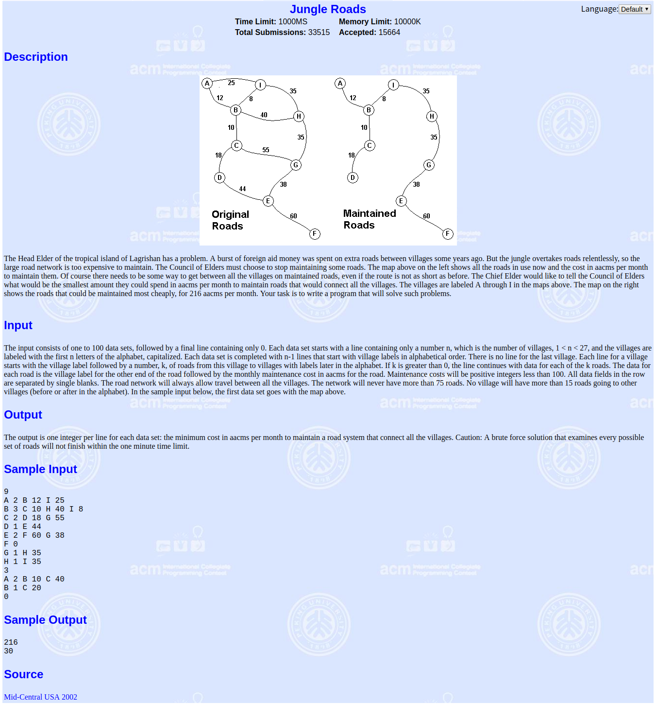

prim算法，kruskal算法，POJ1251入门题目

<!-- more -->

参考：[https://blog.csdn.net/qq_40306845/article/details/81540626](https://blog.csdn.net/qq_40306845/article/details/81540626)

# 题目

**[poj1251--Jungle Roads](http://poj.org/problem?id=1251)**

题意：给你n个点，右n-1条边，每个边都有一个权值，让你求出最小生成树

*题目说明不含重复边*

# prim

- 先任意选择一条边（一般直接选择第一条），连接与其相连权值最小的点，然后两个点成为一个集合体。
- 找这个不在这个集合体里 但是与集合体相连的权值最小的点 与集合体相连，并把该点归入集合体。
- 重复上一条操作，直到集合体归入了所有的点

**时间复杂度**

记顶点数v，边数e

邻接矩阵:O(v2)                 邻接表:O(elog2v)

```c++
#include <iostream>
#include <cstring>
using namespace std;

const int MAXN = 1e2;
int mp[MAXN][MAXN]; ////邻接矩阵
int vis[MAXN], ans[MAXN]; 
//vis[i]:判断第i个顶点有没有走过
//ans[i]:当指定一个点n时，n到第i个点的距离，n的范围是全部点，所以ans是变化的

const int INF = 0x3f3f3f3f;
int n; //顶点个数

void prim()
{
    int sum = 0;
    for(int i = 1; i <= n; i++) //初始化第一个点
    {
        vis[i] = 0;
        ans[i] = mp[1][i];
    }
    vis[1] = 1; //第一个点已经走过
    for(int i = 1; i <= n; i++) //遍历所有的点
    {
        int MIN = INF, pos = 0;
        for(int j = 1; j <= n; j++) //遍历第i个点旁边所有的点
        {
            if(!vis[j] && ans[j] < MIN) //没有走过&&求出ans[]最小值
            {
                MIN = ans[j];
                pos = j; //记录最小位置，即(i, pos)这个点值最小
            }
        }
        if(MIN == INF) //没有找到
            break;
        vis[pos] = 1;
        sum += MIN; //权值和
        for(int k = 1; k <= n; k++) //第一个点走完后，重新初始化下一个点
        {
            /*当前点没有走过&&防止走回去，假如(1,2)已经走过了，
             *如果不加这个条件，可能初始化2这个点的时候，会把（2,1）加进去
             */
            if(!vis[k] && mp[pos][k] < ans[k]) 
                ans[k] = mp[pos][k];
        }
    }
    cout << sum << endl;
}

int main()
{
    ios::sync_with_stdio(false);
    cin.tie(0);
    cout.tie(0);

    int m, k;
    char c1, c2;
    while(cin >> n && n)
    {
        memset(mp, INF, sizeof(mp));
        for(int i = 1; i < n; i++)
        {
            cin >> c1 >> m;
            while(m--)
            {
                cin >> c2 >> k;
                mp[c1-'A'+1][c2-'A'+1] = mp[c2-'A'+1][c1-'A'+1] = k;
            }
        }
        prim();
    }
    return 0;
}

```

# kruskal

- 先选择一条权值最小的边，把这条边相连的两个点归成一个集合。
- 再找下一个权值最小的边，但是边相连的两个点不能属于同一个集合，把这条边相连的两个点（这里也可以是集合）归成一个集合
- 重复上一条操作，直到最后只有一个集合体且归入所有的点。

**时间复杂度**

elog2e  （e为图中的边数）

---------------

`prim`与`kruskal`区别：

1. 集合的个数：`prime`算法自始自终只有一个集合，而`kruskal`算法可以有多个集合，所以`kruskal`算法要用到并查集。
2. 选取的方式：`prime`算法先是任意选取，再根据选取已有的基础上选取权值最小且不在集合的点（取点）。`kruskal`算法则是每次以权值最小的边来选取，可以有多个集合（取边）。
3. 稠密图用prim比kcuskal快的不止一下，稀疏图kruskal更快。

--------------

```c++
#include <iostream>
#include <cstring>
#include <algorithm>
using namespace std;

const int MAXN = 1e2;

int vis[MAXN]; //并查集使用
struct node
{
    int a,b;
    int val;
}mp[MAXN*MAXN]; //储存边的信息，包括起点/终点/权值

bool cmp(node x, node y) //排序函数，边按照权值从小到大排序
{
    return x.val < y.val;
}

int findFather(int x) //并查集寻找祖先
{
    if(vis[x] == 0)
        return x;
    else
        return vis[x] = findFather(vis[x]);
}

int n, len;

void kruskal()
{
    int ans = 0, cnt = 0; //cnt:计算加入的边数
    memset(vis, 0 ,sizeof(vis)); 
    sort(mp, mp + len, cmp); //因为kruskal是靠从边的最小依次查找的，所以直接排序方便查找
    for(int i = 0; i < len; i++)
    {
        int x = findFather(mp[i].a);
        int y = findFather(mp[i].b);
        if(x != y) //如果两个点所属的集合不同就和并
        {
            vis[x] = y;
            ans += mp[i].val;
            cnt++;
            if(cnt == n - 1)
                break;
        }
    }
    if(cnt != n - 1) //图不连通
        cout << "-1" << endl;
    else
        cout << ans << endl;
}

int main()
{
    ios::sync_with_stdio(false);
    cin.tie(0);
    cout.tie(0);

    int m, k;
    char c1, c2;
    while(cin >> n && n)
    {
        len = 0;
        for(int i = 1; i < n; i++)
        {
            cin >> c1 >> m;
            while(m--)
            {
                cin >> c2 >> k;
                mp[len].a = c1-'A'+1;
                mp[len].b = c2-'A'+1;
                mp[len].val = k;
                len++;
            }
        }
        kruskal();
    }
    return 0;
}
```

