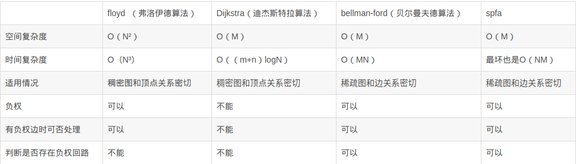

Floyd，Dijkstra， Spfa

<!-- more -->

- Dijkstra：适用于权值为非负的图的单源最短路径，用斐波那契堆的复杂度O(E+VlgV)
- BellmanFord：适用于权值有负值的图的单源最短路径，并且能够检测负圈，复杂度O(VE)
- SPFA：适用于权值有负值，且没有负圈的图的单源最短路径，SPFA的最坏情况应该是O(VE).

- Floyd：每对节点之间的最短路径

（E为边个数，V为顶点个数）

----------------



其中N表示点数，M表示边数

Floyd 算法虽然总体上时间复杂度较高，但可以处理带负权边的图（但不能有负权回路），并且均摊到每一点对上，在所有的算法中还是属于比较优秀的算法。另外，floyd算法较小的编码复杂度也是一大优势，所以，如果要求的是所有点对间的最短路径，或者如果数据范围较小，则floyd算法比较合适。

Dijkstra算法最大的弊端就是他无法处理带有负权边以及负权回路的图，但是Dijkstra算法具有良好的可扩展性，扩展后可以适应很多问题。另外用堆优化的Dijkstra算法的时间复杂度可以达到O（M log N）。当边有负权，甚至存在负权回路时，需要使用Bellman-ford 算法或者队列优化的Bellman-ford算法，因此我们选择最短路径法时，根据实际的需求和每一种算法的特性，选择合适的算法来使用。

参考：[https://blog.csdn.net/yuewenyao/article/details/81023035](https://blog.csdn.net/yuewenyao/article/details/81023035)

---------------

# Floyd(多源最短路)

Floyd算法用于求每一对顶点之间的最短路径，3个for循环就可以。时间复杂度O(v^3) 。v为图顶点个数

模板题：[HDU2544-最短路](http://acm.hdu.edu.cn/showproblem.php?pid=2544)


```c++
/*
2019-02-20 01:02:20
62MS
1844K
*/
#include <iostream>
#include <algorithm>
using namespace std;

const int MAXN = 1e2 + 10;
const int INF = 0X3F3F3F3F;

int dp[MAXN][MAXN];
int n, m, e1, e2, v;

void floyd()
{
    for(int k = 1; k <= n; k++)
        for(int i = 1; i <= n; i++)
            for(int j = 1; j <= n; j++)
                dp[i][j] = min(dp[i][j], dp[i][k] + dp[k][j]);
}

int main()
{
    ios::sync_with_stdio(false);
    cin.tie(0);
    cout.tie(0);

    while(cin >> n >> m && n && m)
    {
        for(int i = 1; i <= n; i++)
        {
            for(int j = 1; j <= i; j++)
            {
                if(i == j)
                    dp[i][j] = 0;
                else
                    dp[i][j] = dp[j][i] = INF;
            }
        }
        for(int i = 1; i <= m; i++)
        {
            cin >> e1 >> e2 >> v;
            dp[e1][e2] = dp[e2][e1] = v;
        }
        floyd();
        cout << dp[1][n] << endl;
    }
    return 0;
}
```

# Dijkstra(单源最短路)

不采用最小优先队列，时间复杂度是O(v^2)，v为图顶点个数

```c++
/*
2019-02-20 02:53:21	
46MS
1848K
*/
#include <iostream>
#include <algorithm>
using namespace std;

const int MAXN = 1e2 + 10;
const int INF = 0X3F3F3F3F;

int dp[MAXN][MAXN];
int vis[MAXN];
int dis[MAXN];
int n, m, e1, e2, v, MIN;

void dijkstra(int beg)
{
    for(int i = 1; i <= n; i++)
    {
        vis[i] = 0;
        dis[i] = dp[beg][i];
    }
    vis[beg] = 1;
    for(int i = 1; i <= n; i++)
    {
        int k = 0;
        MIN = INF;
        for(int j = 1; j <= n; j++) //寻找开始点到其他点最小值及位置
        {
            if(vis[j] == 0 && MIN > dis[j])
            {
                MIN = dis[j];
                k = j;
            }
        }
        vis[k] = 1;
        for(int j = 1; j <= n; j++) //三点合并
        {
            if(vis[j] == 0 && dis[k] + dp[k][j] < dis[j])
                dis[j] = dis[k] + dp[k][j];
        }
    }
}

int main()
{
    ios::sync_with_stdio(false);
    cin.tie(0);
    cout.tie(0);

    while(cin >> n >> m && n && m)
    {
        for(int i = 1; i <= n; i++)
        {
            for(int j = 1; j <= i; j++)
            {
                if(i == j)
                    dp[i][j] = 0;
                else
                    dp[i][j] = dp[j][i] = INF;
            }
        }
        for(int i = 1; i <= m; i++)
        {
            cin >> e1 >> e2 >> v;
            dp[e1][e2] = dp[e2][e1] = v;
        }
        dijkstra(1);
        cout << dis[n] << endl;
    }
    return 0;
}

```

# Spfa

邻接表，队列优化

```c++
/*
2019-02-21 00:59:10
46MS	
1980K
*/
#include <iostream>
#include <cstring>
#include <algorithm>
#include <queue>
using namespace std;

const int MAXN = 10000 + 10;
const int INF = 0X3F3F3F3F;

struct node
{
    int to, next, cost;
}edge[MAXN];
int head[MAXN];
int dis[MAXN];
int vis[MAXN];

int n, m, e1, e2, v, len;

void add(int from, int to, int cost)
{
    edge[len].to = to;
    edge[len].cost = cost;
    edge[len].next = head[from];
    head[from] = len++;
}

void spfa(int beg)
{
    dis[beg] = 0;
    vis[beg] = 1;
    queue<int>q;
    q.push(beg);
    while(!q.empty())
    {
        int u = q.front();
        q.pop();
        vis[u] = 0;
        for(int i = head[u]; i != -1; i = edge[i].next)
        {
            int v = edge[i].to;
            int c = edge[i].cost;
            if(dis[v] > dis[u] + c)
            {
                dis[v] = dis[u] + c;
                if(vis[v] == 0)
                {
                    vis[v] = 1;
                    q.push(v);
                }
            }
        }
    }
}

int main()
{
    ios::sync_with_stdio(false);
    cin.tie(0);
    cout.tie(0);

    while(cin >> n >> m && n && m)
    {
        memset(head, -1, sizeof(head));
        memset(vis, 0 , sizeof(vis));
        memset(dis, INF, sizeof(dis));
        len = 0;
        for(int i = 1; i <= m; i++)
        {
            cin >> e1 >> e2 >> v;
            add(e1, e2, v);
            add(e2, e1, v);
        }
        spfa(1);
        if(dis[n] == INF)
            cout << "-1" << endl;
        else
            cout << dis[n] << endl;
    }
    return 0;
}

```

