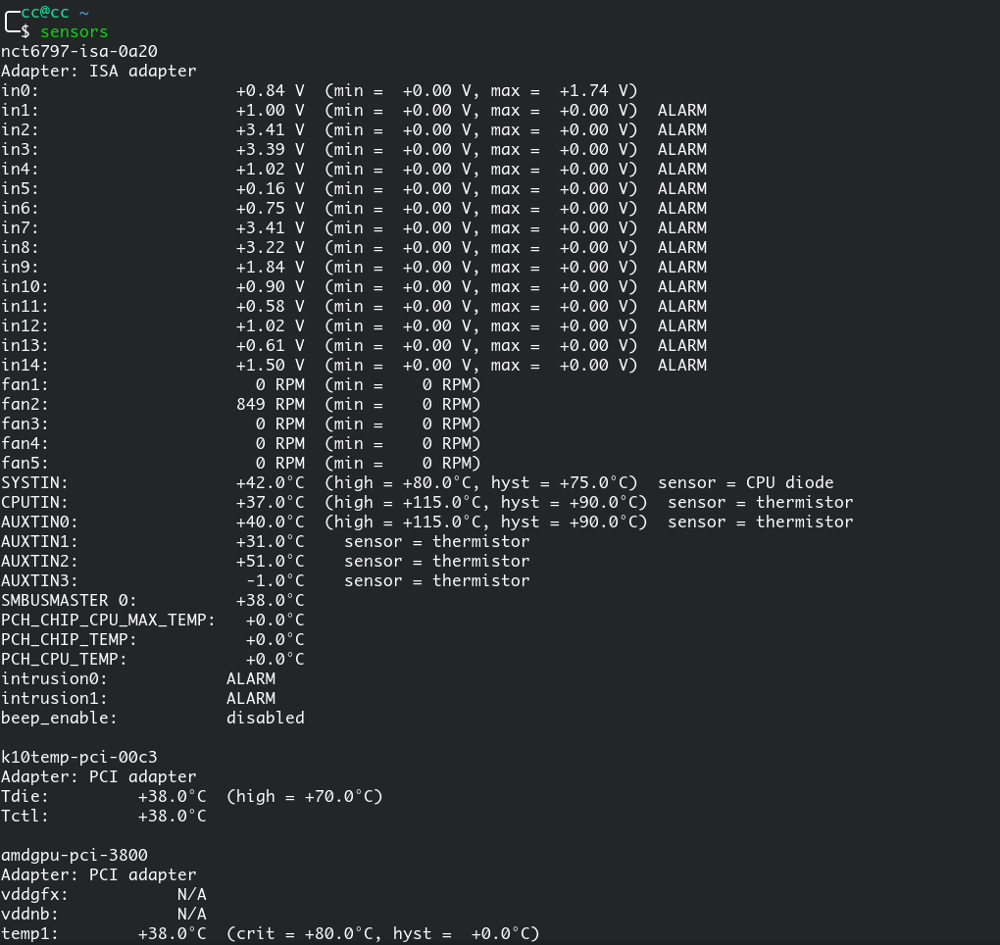

AMD Ryzen Temperatures

<!-- more -->

参考:

[Monitor AMD Ryzen Temperatures In Linux with latest kernel modules](<https://linuxconfig.org/monitor-amd-ryzen-temperatures-in-linux-with-latest-kernel-modules>)

---

因为需要查看一些硬件的温度，又加上目前`5.1.7-arch1-1-ARCH`内核只是显示cpu温度，所以需要自己加载一些模块，其实过程还是很简单的

要求：

使用内核4.11或更高版本以及root权限的Linux安装。

具体流程：

# 确定modules

`Ryzen`板上一般有两种模块。他们是`it87`和`nct6775`。旧的主板一般是前者，新的一般是后者，具体的可以搜索下，本次使用的`MSI B450 TOMAHAWK`属于后者

# 具体命令

```shell
sudo pacman -S linux-headers
yay -S nct6775-master-dkms-git
sudo vim /etc/modules-load.d/modules.conf
#往文件里面添加"nct6775"
sudo modprobe nct6775
sudo reboot
sensors
```



