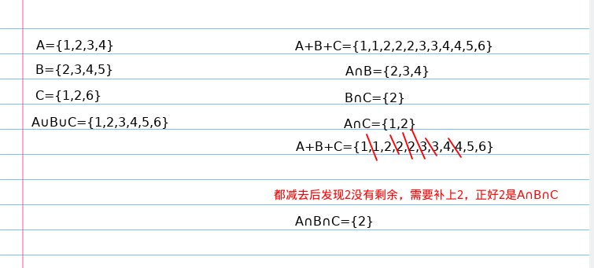
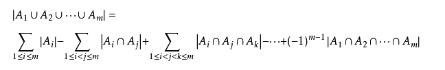
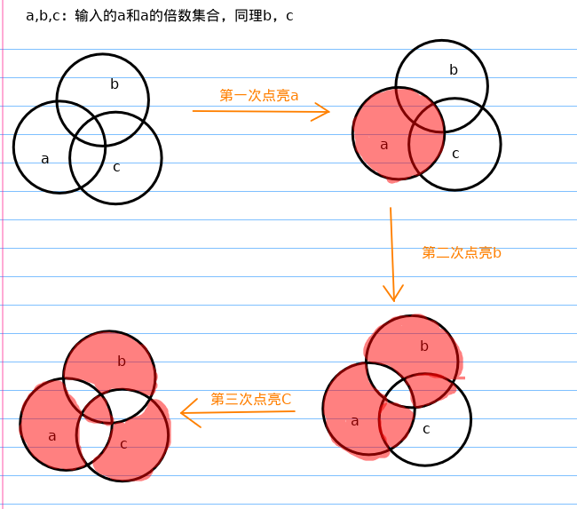
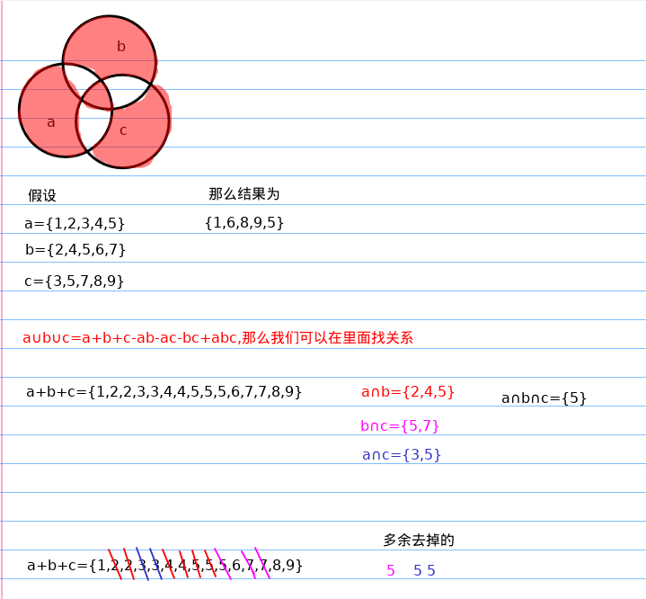

容斥与抽屉定理

<!-- more -->

# 容斥定理

## 定理

参考：百度百科

在计数时，必须注意没有重复，没有遗漏。为了使重叠部分不被重复计算，人们研究出一种新的计数方法，这种方法的基本思想是：先不考虑重叠的情况，把包含于某内容中的所有对象的数目先计算出来，然后再把计数时重复计算的数目排斥出去，使得计算的结果既无遗漏又无重复，这种计数的方法称为容斥原理。

- 两个集合的容斥关系公式：A∪B =|A∪B| = |A|+|B| - |A∩B |(∩：重合的部分）

- 三个集合的容斥关系公式：|A∪B∪C| = |A|+|B|+|C| - |A∩B| - |B∩C| - |C∩A| + |A∩B∩C|

例如三个集合的关系：



(图里面的A+B+C划红色部分应该是划去{2,3,4,2,1,2}，即划去A∩B，B∩C，A∩C)

- 一般情况：



## [51nod1284](https://www.51nod.com/Challenge/Problem.html#!#problemId=1284)


容斥定理，先求反面，即1-N有多少是2 3 5 7的倍数，然后再用总数减去反面的数量即为所求。

```
cnt = A2+A3+A5+A7-(A23+A25+A27+A35+A37+A57)+(A235+A237+A257+A357)-A2357
```

A2表示被2整除的个数  即N/2  A23为即被2又被3整除的个数即N/6

```c++
/*
15ms
1912KB 
c++11
2019/5/7 8:10:44
*/
#include <cstdio>
using namespace std;
typedef long long ll;

int main()
{
    ll n;
    scanf("%lld", &n);
    ll cnt = 0;
    
	//A2+A3+A5+A7
    cnt += (n/2 + n/3 + n/5 + n/7); 
    //A23+A25+A27+A35+A37+A57
    cnt -= (n/6 + n/10 + n/14 + n/15 + n/21 + n/35); 
    //A235+A237+A257+A357
    cnt += (n/30 + n/42 + n/70 + n/105);
    //A2357
    cnt -= (n/210);
    printf("%lld\n", n - cnt);
    return 0;
}

```

## [电灯泡](http://120.78.128.11/Problem.jsp?pid=2332)


因为最后求的是亮的个数。那么我们只需要关心a和a的倍数，b和b的倍数，c和c的倍数，其他数没有的电灯泡没有被点亮，所以就不用处理

点亮三次情况如下：



那么最终变成了求被染色的面积



我们根据容斥定理可以尝试去推理求法，首先结果里面没有2，而2又是a∩b的结果，所以可以尝试去掉2个a∩b，如此类推，推出答案为`a+b+c-2ab-2bc-2ac+4abc（ab,bc,ac代表的是这两个数的倍数）`，或者也可以根据图形关系结合容斥定理来求结果的表达式。

----

那么倍数的数量如何求？

假设求1-10里面3的倍数有几个，自然可以用到10/3

如果是2个数呢？

假设求1-50里面3,5的倍数有几个，那么可以直接50/(3*5)=3：{15,30,45}

那么求4,6呢，还能50/(4*6)=2吗？

我们知道1-50中，4,6的倍数有{12,24,36,48}，明显不对

因为4,6不是互质，所以结果应该是`50*gcd(4,6)/(4*6)`

因为本题目的a，b，c都是互质，所以就不用考虑这种情况

然后，因为给出的数的范围较大，所以我们可以将*变为/

```c++
/*
0MS	6348KB	208	2019-05-07 17:18:01
*/
#include <cstdio>
using namespace std;

int main()
{
    int n, t;
    scanf("%d", &t);
    int a, b, c;
    while(t--)
    {
        scanf("%d", &n);
        scanf("%d %d %d", &a, &b, &c);
        int ans = n/a+n/b+n/c - 2*(n/a/b + n/b/c + n/a/c) + 4*(n/a/b/c);
        printf("%d\n", ans);
    }
    return 0;
}
```

# 抽屉定理

## 定理

参考：百度百科

桌上有十个苹果，要把这十个苹果放到九个抽屉里，无论怎样放，我们会发现至少会有一个抽屉里面至少放两个苹果。这一现象就是我们所说的“抽屉原理”。 
抽屉原理的一般含义为：“如果每个抽屉代表一个集合，每一个苹果就可以代表一个元素，假如有n+1个元素放到n个集合中去，其中必定有一个集合里至少有两个元素。”
抽屉原理有时也被称为鸽巢原理。它是组合数学中一个重要的原理。

## 第一抽屉定理

- 原理1： 把多于n+1个的物体放到n个抽屉里，则至少有一个抽屉里的东西不少于两件。

- 原理2 ：把多于(mn+1，n不为0)个的物体放到n个抽屉里，则至少有一个抽屉里有不少于（m+1）的物体。

- 原理3 ：把无穷多件物体放入n个抽屉，则至少有一个抽屉里有无穷个物体。

## 第二抽屉定理

把(mn-1)个物体放入n个抽屉中，其中必有一个抽屉中至多有(m-1)个物体(例如，将3×5-1=14个物体放入5个抽屉中，则必定有一个抽屉中的物体数少于等于3-1=2)

## 最差原则

最差原则，即考虑所有可能情况中，最不利于某件事情发生的情况。

例如，有300人到招聘会求职，其中软件设计有100人，市场营销有80人，财务管理有70人，人力资源管理有50人。那么至少有多少人找到工作才能保证一定有70人找的工作专业相同呢？

此时我们考虑的最差情况为：软件设计、市场营销和财务管理各录取69人，人力资源管理的50人全部录取，则此时再录取1人就能保证有70人找到的工作专业相同。

（人力资源管理全部录取，其他各录取69，再多1人就可以保证有70人工作专业相同，因为这1个人一定是软件设计，财务管理，市场营销的，不会是人力资源管理的，所以再加一个人就可以保证了）

因此至少需要69*3+50+1=258人。

## [Nyoj417死神来了](http://nyoj.top/problem/417)


假如存在倍数关系，有倍数关系的当为一组。

- 当n为偶数，最多有n/2组分组(按照2的倍数关系分组)

- 假如是奇数，最多有n/2+1组分组

统一写为p=n/2+(n&1)组

（n&1：n为奇数时结果为1，n为偶数结果为0）

例如：

当n=20时，可分组为

```
A1 = {1, 2, 4，8, 16}
A2 = {3, 6, 12}
A3 = {5, 10, 20}
A4 = {15}
A5 = {7, 14}
A6 = {9，18}
A7 = {11}
A8 = {13}
A9 = {17}
A10 = {19} 
共十组
```

存在最坏情况，我们取{19, 17, 13, 11, 18, 14, 15, 20, 12, 16}，也就是取每一组最后一个元素，这样就不存在任意一个数是另外一个数的倍数，所以m至少得取11，即m>n/2。

**取11时，比取10时多一个数，那么就可能至少有2个数出现在同一个倍数集合中，因为取10时是所有组中都取一个数,。正好对应了抽屉定理，无论怎么放至少会有一个抽屉里面至少放两个苹果。**

当n=21时，加一个分组A11={21}，那么m得取12，即m>(n/2+1)

```c++
/*
5 ms 	1156 KB
2019-05-06 21:34:12
*/
#include <cstdio>
using namespace std;

int main()
{
    int n, m;
    while(scanf("%d %d", &n, &m) != EOF)
    {
        n = n/2+(n&1);
        if(m > n)
            printf("YES\n");
        else
            printf("NO\n");
    }
    return 0;
}
```


