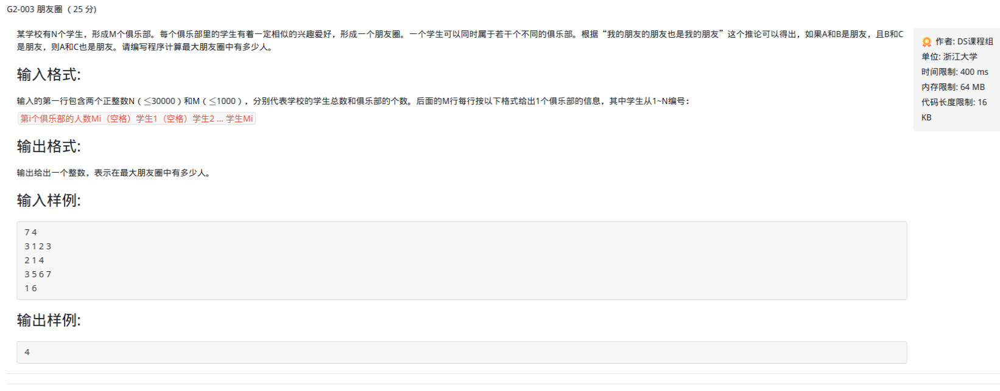

并查集模板

<!-- more -->
参考：
[https://www.xuebuyuan.com/3256535.html](https://www.xuebuyuan.com/3256535.html)

# 总体思路

**1. 初始化**：

把每个点所在集合初始化为其自身。  

通常来说，这个步骤在每次使用该数据结构时只需要执行一次，无论何种实现方式，时间复杂度均为O(N)。  

**2.查找：**

查找元素所在的集合，即根节点

**3.合并：**

两个元素所在的集合合并为一个集合。  

通常来说，合并之前，应先判断两个元素是否属于同一集合，这可用上面的“查找”操作实现

# 状态压缩

建立门派的过程是用join函数两个人两个人地连接起来的，谁当谁的手下完全随机。最后的树状结构会变成什么样，我也无法预知，一字长蛇阵也有可能。这样查找的效率就会比较低下。最理想的情况就是所有人的直接上级都是掌门，一共就两级结构，只要找一次就找到掌门了。哪怕不能完全做到，也最好尽量接近。这样就产生了路径压缩算法。

# 例题

##  题目

**Input**

输入多组数据

每组数据第一行是两个整数n（1＜＝n＜＝10＾6），m（1＜＝m＜＝10＾6）。分别表示元素数、操作数（初始时每个元素以自己为一个集合元素编号是1-n）  

接下来m行，每行有如下几种输入:    

union x y——表示将x所在的集台和y所在的集合合并为一个集合   

same x y——询问x和y是否为同一个集台，为同一个集合输出1，不同集合输出0     

num x——询问x所在的集合共有多少个元素   

max x——询问x所在的集合中元素编号最大是多少    

setuum 询问现在总共有多少个集合   

**Output**

对于每个操作输出一行，用一个整数表示答案

**SimpleInput**

5 10  

setnum  

same 1 2  

union 1 2  

same 1 2  

union 2 3  

same 1 3  

union 4 5  

setnum  

max 1  

num 4  

**SimpleOutput**

5  
0  
1  
1  
2  
3  
2  

```c++
#include <iostream>
#include <string>
#include <algorithm>
using namespace std;
const int len = 1e6 + 10;
int pre[len], Max[len], num[len]; //数组Max：保存集合最大值，num：保存的是集合个数

int Find(int x) //路径压缩
{
    int p, tmp;
    p = x;
    while(x != pre[x]) //判断上一级是不是自己本身
        x = pre[x]; //将x变成x对应的根节点
    while(p != x) //如果不是的话，那么就将x连到根节点上面去
    {
        tmp = pre[p];
        pre[p] = x;
        p = tmp;
    }
    return x;
}

void Join(int x, int y)
{
    int p, q;
    p = Find(x);
    q = Find(y);
    if(p != q)
    {
        pre[p] = q;
        Max[q] = max(Max[q], Max[p]); //求集合最大值，因为现在q是根节点，将根节点和之前p的值想比较
        num[q] += num[p]; //求集合的个数，将原本根节点的数加上后来并上的
    }
}
int main()
{
    ios::sync_with_stdio(false);
    int n, m;
    cin >> n >> m;
    for(int i = 0; i < n; i++)
    {
        pre[i] = i;  //让自己成为根节点，即各自都没有关系
        num[i] = 1;
        Max[i] = 1;
    }
        
    while(m--)
    {
        int x, y;
        string s;
        cin >> s; 
        int cnt = n; //初始状态共有n个集合
        if(s == "union")
        {
            cin >> x >> y;
            if(Find(x) != Find(y))  //不在一个集合，合并
            {
                Join(x, y);
                cnt--; //集合个数减一
            }             
        }
        else if(s == "same")
        {
            cin >> x >> y;
            if(Find(x) == Find(y))
                cout << "1" << endl;
            else
                cout << "0" << endl;
        }   
        else if(s == "num")
        {
            cin >> x;
            cout << num[Find(x)] << endl; //找到根结点，然后输出个数
        } 
        else if(s == "max")
        {
            cin >> x;
            cout << Max[Find(x)] << endl;
        }
        else 
            cout << cnt << endl;
    }
    return 0;
}
```

# 模板



## 未路径压缩

```c++
#include <iostream>
#include <cstdio>
#include <cstdlib>
#include <cstring>
#include <cmath>
#include <algorithm>
using namespace std;
const int Max = 30010;
int n,m;
int pre[Max],People[Max];

int find(int x){
	while(x != pre[x])
		x = pre[x];
	return x;
}
void Union(int x,int y){
	x = find(x);
	y = find(y);
	if(x!=y)
		pre[y] = x;
}
int main(){
	scanf("%d %d",&n,&m);
	int a,b,num;
	for(int i = 1; i <= n; i++)
		pre[i] = i;
	while(m--){
		scanf("%d",&num);
		if(num>0)
			scanf("%d",&a);
		for(int i = 1; i < num; i++){
			scanf("%d",&b);
			Union(a,b);
		}
	}
	for(int i = 1; i <= n; i++)
		People[i] = 0;
	int k;
	for(int i = 1; i <= n; i++){
		k = find(i);
		People[k]++;
	}
	int maxn = 0;
	for(int i = 1; i <= n; i++)
		maxn = max(maxn,People[i]);
	printf("%d\n",maxn);
	return 0;
}
```

## 路径压缩，效率更高

```c++
#include <iostream>
#include <cstdio>
#include <cstdlib>
#include <cstring>
#include <cmath>
#include <algorithm>
using namespace std;
const int Max = 30005;
int n,m;
int par[Max],People[Max];

int find(int x)  //找根
{
    if(par[x]==x)
       return x;
    else
        return par[x]=find(par[x]);//路径压缩，使路径上经过的所有节点直接连到根
}
void Union(int x,int y) //合并
{
	x = find(x); //找x的根，
	y = find(y); //找y的根
	if(x!=y)     //根不同，可见不在同一棵树
		par[y] = x;  //把一棵树的根作为另一棵树的根的儿子
}
int main()
{
	scanf("%d %d",&n,&m);
	int a,b,num;
	for(int i = 1; i <= n; i++)
		par[i] = i;  //初始化，每个节点一开始都各自是根，其par是其自己。
	while(m--)
    {
		scanf("%d",&num);
		if(num>0)
			scanf("%d",&a);
		for(int i = 1; i < num; i++)
		{
			scanf("%d",&b);
			Union(a,b);
		}
	}
	for(int i = 1; i <= n; i++)
		People[i] = 0;
	int k;
	for(int i = 1; i <= n; i++){
		k = find(i);
		People[k]++;
	}
	int maxn = 0;
	for(int i = 1; i <= n; i++)
    {
        if(People[i]>maxn)
            maxn = People[i];
    }
	printf("%d\n",maxn);
	return 0;
}

```


