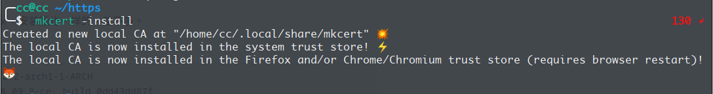
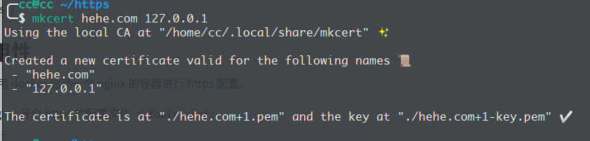
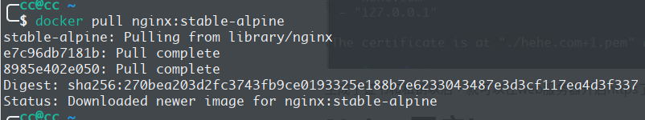
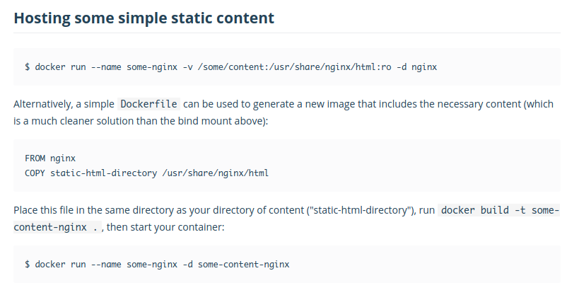
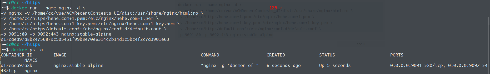
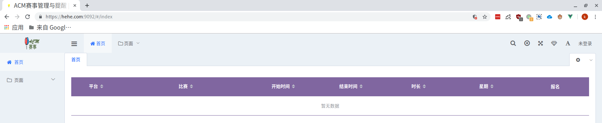
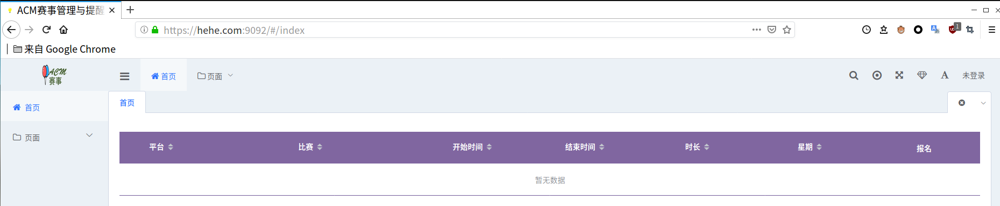

利用nginx搭建一个https本地可用的域名

<!-- more -->

# 环境

利用到的工具：

- [mkcert--本地生成浏览器信任的本地 https 证书](https://github.com/FiloSottile/mkcert)

- Nginx
- Docker（可选）

本篇教程利用的是`docker nginx`，安装版也一样的，差不多。

本地环境：

```
本机：Arch Linux x86_64 5.2.2-arch1-1-ARCH
Docker： Docker version 18.09.8-ce, build 0dd43dd87f
Nginx：stable-alpine
```

# 安装mkcert

其他系统的安装方法可以看`github`上面的介绍，本次按照的是`Arch`系统的安装方法。

```shell
sudo pacman -S nss
yay -S mkcert
```

# 生成证书

- 生成CA（certificate authority，即证书颁发机构），运行下面的命令可以在`~/.local/share/mkcert/`生成`rootCA.pem`和`rootCA-key.pem`a两个文件，这个命令只需运行一次，因为生成的CA可以反复使用；

  使用`mkcert -install`命令即可



- 创建自签名证书，例如要为域名：`hehe.com`和IP：`127.0.0.1`创建证书，可以使用如下的命令：

  ```
  mkcert hehe.com 127.0.0.1
  ```

  上述命令会自动使用第1步创建的`CA`生成证书文件，其中`xxx.pem`为证书，`xxx-key.pem`为私钥，你也可以使	用`-cert-file`和`-key-file`两个参数设置生成文件的文件名。

  注意：为了便于管理，建议在单独目录下生成本地证书及密钥*



生成了证书和私钥以后，就可以在web服务器开启https了

# Nginx开启https

## 拉取镜像

首先我们需要拉取一个镜像

```shell
docker pull nginx:stable-alpine
```




## 配置文件

**需要说明的是，在`nginx docker`里面，`Nginx`配置文件在`/etc/nginx`，静态资源在`/usr/share/nginx/html`**

这里准备一个`Nginx`文件`default.conf`

```shell
server {
    listen       443;
    server_name  hehe.com;

    ssl on;
    # 相对于/etc/nginx
    ssl_certificate hehe.com+1.pem;
    ssl_certificate_key hehe.com+1-key.pem;
    
    location / {
        root   /usr/share/nginx/html;
        index  index.html index.htm;
    }
}
```

## 启用docker

然后启用镜像，启动镜像的过程中可以配置映射，映射我们的静态资源文件夹，端口映射以及`https`文件映射



更多可参考：[nginx - Docker Hub](https://hub.docker.com/_/nginx)

这里本地静态资源文件夹目录为`/home/cc/vue/ACMRecentContests_UI/dist`，`default.con`和两个秘钥分别是

```
/home/cc/https/hehe.com+1-key.pem
/home/cc/https/hehe.com+1.pem
/home/cc/https/default.conf
```

所以我们可以映射如下：

```shell
docker run --name nginx -d \
-v nginx -v /home/cc/vue/ACMRecentContests_UI/dist:/usr/share/nginx/html:ro \
-v /home/cc/https/hehe.com+1.pem:/etc/nginx/hehe.com+1.pem \
-v /home/cc/https/hehe.com+1-key.pem:/etc/nginx/hehe.com+1-key.pem \
-v /home/cc/https/default.conf:/etc/nginx/conf.d/default.conf \
-p 9091:80 -p 9092:443 nginx:stable-alpine
```



# 测试

## Chrome75



## Firefox69




# 关于docker nginx的其他命令

```shell
#启动
docker start nginx

#停止
docker stop nginx

#进入
docker exec -it nginx sh

#删除容器，需要先停止
docker rm nginx

#删除镜像
docker rmi nginx:stable-alpine
```


---

参考：

[mkcert:本地有效的https证书-吕啸腾的博客](https://aeric.io/post/mkcert-valid-https-certificates-for-localhost/)

---

