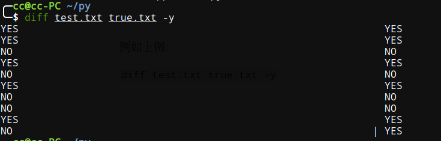

采用文件读写办法进行样例测试以及生成各种测试用例

 <!-- more -->

写OJ调试的时候如果输入数据比较多，每次调试手动输入会很麻烦，把测试数据写到文件里用文件输入会比较方便。*本次主要用`freopen`进行文件读取*

# freopen

参考

[https://blog.csdn.net/u013480600/article/details/18372341](https://blog.csdn.net/u013480600/article/details/18372341)

## 头文件

首先必须知道调取`freopen`必须用到头文件` cstdio` 或者 `stdio.h`

## 函数声明

```c++
FILE * freopen ( const char * filename, const char * mode, FILE * stream );
//filename: 要打开的文件名
//mode: 文件打开的模式，和fopen中的模式(r/w)相同
//stream: 文件指针，通常使用标准流文件(stdin/stdout/stderr)
```

## 使用方法

*因为文件指针使用的是标准流文件，因此我们可以不定义文件指针*

1. 使用`freopen()`函数以只读方式r(read)打开测试样例文件`in.txt`

   ```c++
   freopen("in.txt", "r", stdin);
   ```

   以写入方式w(write)打开输出文件`out.txt`

   ```c++
   freopen("out.txt", "w", stdout);
   ```

2. 不再需要修改输入和输出，而是维持代码的原样就可以了。因为freopen()函数重定向了标准流，使其指向前面指定的文件。
3. 使用`fclose`关闭输入文件和输出文件

```c++
fclose(stdin);
fclose(stdout);
```

注意：

- 最好使用扩展名为`.txt`，因为它最稳定
- 注意文件的路径

- 一定要用`fcolse`关闭,否则下次继续读取或写入数据的时候很有可能出错.

- `in.txt`必须已经创建，`out.txt`不需要，无则---系统会自动创建，有则---原来文件中的内容会被全部更新。

## 模板

```c++
	
#include <stdio.h>   
int main()
{
    freopen("in.txt", "r", stdin);
    freopen("out.txt", "w", stdout);
    /* 中间按原样写代码，什么都不用修改 */  
    fclose(stdin);
    fclose(stdout);
 return 0;
}
```

# 测试样例生成

工具：

[https://github.com/luogu-dev/cyaron](https://github.com/luogu-dev/cyaron)

该文件需要python环境，详细看`README.md`

一个生成样例python代码

```python
#!/usr/bin/env python
from cyaron import *

io = IO("test.in") 
#生成20个
for i in range(1, 21):
    #生成一个4到6个字母之间的单词，只有'a','b'组成的字符串，a的可能性是90%，b的可能性是10%
    str = String.random((4,6), charset="aaaaaaaaab")
    io.input_writeln(str)
```

# 文件对比

有时候需要对比一下找出一些错误，例如：

已知测试样例文件`testcase.txt`，正确代码输出文件`true.txt`，测试代码输出文件`test.txt`

**在linux下**可以使用`diff`命令对比

```powershell
diff(选项)(参数)
```

- **选项**

```
-<行数>：指定要显示多少行的文本。此参数必须与-c或-u参数一并使用；
-a或——text：diff预设只会逐行比较文本文件；
-b或--ignore-space-change：不检查空格字符的不同；
-B或--ignore-blank-lines：不检查空白行；
-c：显示全部内容，并标出不同之处；
-C<行数>或--context<行数>：与执行“-c-<行数>”指令相同；
-d或——minimal：使用不同的演算法，以小的单位来做比较；
-D<巨集名称>或ifdef<巨集名称>：此参数的输出格式可用于前置处理器巨集；
-e或——ed：此参数的输出格式可用于ed的script文件；
-f或-forward-ed：输出的格式类似ed的script文件，但按照原来文件的顺序来显示不同处；
-H或--speed-large-files：比较大文件时，可加快速度；
-l<字符或字符串>或--ignore-matching-lines<字符或字符串>：若两个文件在某几行有所不同，而之际航同时都包含了选项中指定的字符或字符串，则不显示这两个文件的差异；
-i或--ignore-case：不检查大小写的不同；
-l或——paginate：将结果交由pr程序来分页；
-n或——rcs：将比较结果以RCS的格式来显示；
-N或--new-file：在比较目录时，若文件A仅出现在某个目录中，预设会显示：Only in目录，文件A 若使用-N参数，则diff会将文件A 与一个空白的文件比较；
-p：若比较的文件为C语言的程序码文件时，显示差异所在的函数名称；
-P或--unidirectional-new-file：与-N类似，但只有当第二个目录包含了第一个目录所没有的文件时，才会将这个文件与空白的文件做比较；
-q或--brief：仅显示有无差异，不显示详细的信息；
-r或——recursive：比较子目录中的文件；
-s或--report-identical-files：若没有发现任何差异，仍然显示信息；
-S<文件>或--starting-file<文件>：在比较目录时，从指定的文件开始比较；
-t或--expand-tabs：在输出时，将tab字符展开；
-T或--initial-tab：在每行前面加上tab字符以便对齐；
-u，-U<列数>或--unified=<列数>：以合并的方式来显示文件内容的不同；
-v或——version：显示版本信息；
-w或--ignore-all-space：忽略全部的空格字符；
-W<宽度>或--width<宽度>：在使用-y参数时，指定栏宽；
-x<文件名或目录>或--exclude<文件名或目录>：不比较选项中所指定的文件或目录；
-X<文件>或--exclude-from<文件>；您可以将文件或目录类型存成文本文件，然后在=<文件>中指定此文本文件；
-y或--side-by-side：以并列的方式显示文件的异同之处；
--help：显示帮助；
--left-column：在使用-y参数时，若两个文件某一行内容相同，则仅在左侧的栏位显示该行内容；
--suppress-common-lines：在使用-y参数时，仅显示不同之处。
```

- **参数**
  - 文件1：指定要比较的第一个文件；
  - 文件2：指定要比较的第二个文件。


例如上例：

`diff test.txt true.txt -y`



然后就可以知道哪个测试样例出错了。

其他系统可以自行查找工具。

## 多次对比

有时候可能一次测试的样例不错，我们需要不断生成测试样例，但是如果一次性生成过多会造成查找以及对比麻烦，所以一次性最好不要生成太多测试样例。

最好办法是多次生成不同的测试样例。

举例，有下列文件:

```
生成测试样例规则：ceate.py
测试样例：testcase.txt
测试代码：test.cpp
正确代码: true.cpp
测试代码输出：test.txt
正确代码: true.txt
```

1. 我们可以先生成测试样例`testcase.txt`

```python
python ceate.py
```

2. 编译两个cpp文件

```powershell
g++ -o true true.cpp
g++ -o test test.cpp
```

3. 运行文件

```powershell
./true
./test
```

​	这样就就生成了两个输出文件，一个是正确的` true.txt`，一个测试的`test.txt`，然后我们就可以使用`dif`工具对比。接着，再次进行生成测试样例并且测试

4. 再次生成测试样例

```python
python ceate.py
```

5. 这次我们只需要

```powershell
./true
./test
```

​	就可以重新运行并且生成新的输出文件，然后就再对比，如此循环