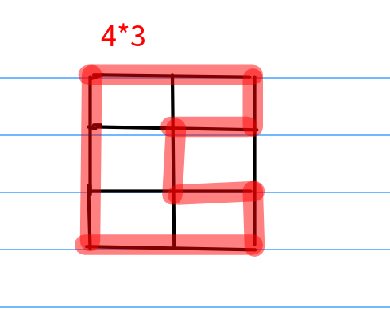
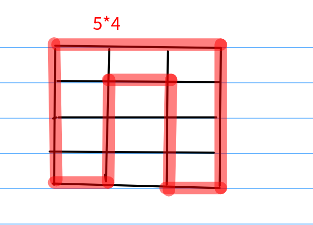
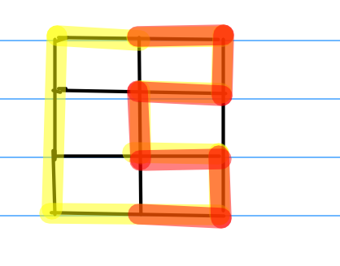

牛客--[Applese 走迷宫](https://ac.nowcoder.com/acm/contest/330/C)

<!-- more -->

模拟题，就是给出个m×n矩阵，从(0,0)开始，输出一种方案能够不重复得走完所有的点并且回到起点，没有的话输出-1。

掉了两个坑：

- 特殊情况：1行2列或2行1列，没有考虑这个也可以回到原点，以为只要是`m==1||n==1`就不能走了
- 没有考虑到别的走法，以至于以为`m%2==0`就不能走了

有一个还需要的优化的地方就是代码逻辑。

**解析**

主要是两种情况，当`n%2==0`时，可以按照下面这种走法输出方案



当`n%2!=0&&m%2==0`时，可以按照下面这种走法输出方案



其他情况都没有方案，输出-1

代码逻辑方面，有一部分都是一样的输出，所以可重复利用，如红色部分。所以可精简代码。



```c++
/*
提交时间：2019-01-29 19:41:29 语言：C++ 代码长度：1360 运行时间： 5 ms 占用内存：504K 
运行状态：答案正确
*/
#include <bits/stdc++.h>
using namespace std;
  
int main()
{
    ios::sync_with_stdio(false);
    cin.tie(0);
    cout.tie(0);
 
    int n, m;
    cin >> n >> m;
    if (n == 1)
    {
        if (m == 2)
            cout << "RL" << endl;
        else
            cout << -1 << endl;
    }
    else if (m == 1)
    {
        if (n == 2)
            cout << "DU" << endl;
        else
            cout << -1 << endl;
    }
    else if (n % 2 == 0)
    {
        cout << "R";
         //重复利用部分
        for (int i = 0; i < n; i += 2)
        {
            if (i)
                cout << "D";
            for (int j = 1; j < m - 1; j++)
                cout << "R";
          //  
            cout << "D";
            for (int j = 1; j < m - 1; j++)
                cout << "L";
        }
        cout << "L";
        for (int i = 0; i < n - 1; i++)
            cout << "U";
        cout << endl;
    }
    else if (m % 2 == 0)
    {
        cout << "D";
        for (int i = 0; i < m; i += 2)
        {
            if (i)
                cout << "R";
            for (int j = 1; j < n - 1; j++)
                cout << "D";
            cout << "R";
            for (int j = 1; j < n - 1; j++)
                cout << "U";
        }
        cout << "U";
        for (int i = 0; i < m - 1; i++)
            cout << "L";
        cout << endl;
    }
    else
        cout << -1 << endl;
    return 0;
}
```

