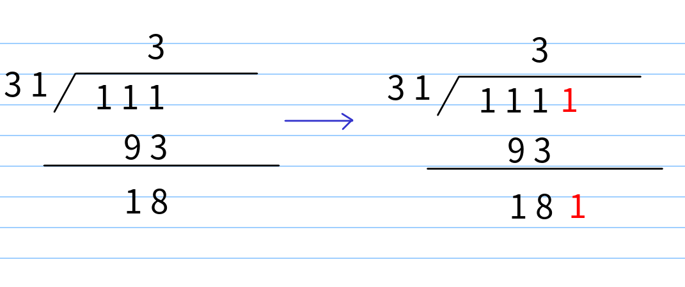

天梯赛练习L1-046. 整除光棍

<!-- more -->

# [L1-046 整除光棍](https://pintia.cn/problem-sets/994805046380707840/problems/994805084284633088)

## 题目

```
时间限制: 400 ms
内存限制: 64 MB
代码长度限制: 16 KB
```

**题目描述**

这里所谓的“光棍”，并不是指单身汪啦~ 说的是全部由1组成的数字，比如1、11、111、1111等。传说任何一个光棍都能被一个不以5结尾的奇数整除。比如，111111就可以被13整除。 现在，你的程序要读入一个整数`x`，这个整数一定是奇数并且不以5结尾。然后，经过计算，输出两个数字：第一个数字`s`，表示`x`乘以`s`是一个光棍，第二个数字`n`是这个光棍的位数。这样的解当然不是唯一的,题目要求你输出最小的解。

提示：一个显然的办法是逐渐增加光棍的位数，直到可以整除`x`为止。但难点在于，`s`可能是个非常大的数 —— 比如，程序输入31，那么就输出3584229390681和15，因为31乘以3584229390681的结果是111111111111111，一共15个1。

**输入格式**

输入在一行中给出一个不以5结尾的正奇数x(<1000)​。

**输出格式**

在一行中输出相应的最小的`s`和`n`，其间以1个空格分隔。

**样例1**

输入

```
31
```

输出

```out
3584229390681 15
```

# 解析

模拟除法应用

然后模拟除法的话



我们先构造出比x大的最小光棍数，然后判断能不能整除于x，不能的话就继续往这个光棍数后面加1.

流程：

- 光棍数能整除于x
  - 输出答案
- 不能整除
  - 先算出目前光棍数除以x的值
  - 然后在后面加上1，然后继续循环判断

```c++
/*
2019/2/17 14:29:18	4 ms
*/

#include<bits/stdc++.h>
using namespace std;

int main()
{
    ios::sync_with_stdio(false);
    cin.tie(0);
    cout.tie(0);

    int n;
    cin >> n;
    int num = 1, len = 1; //num为光棍数，len为光棍数长度
    while(num < n) //先构造出比x大的最小光棍数
    {
        num = num*10 + 1;
        len++;
    }
    while(true)
    {
        if(num % n == 0) //能整除于x，就是答案
        {
            cout << num / n << " " << len;
            break;
        }
        else //不能的话就进位
        {
            cout << num / n; 
            num %= n; //取得余数
            num = num*10 + 1; //往余数后面+1
            len++;
        }
    }
    return 0;
}
```

