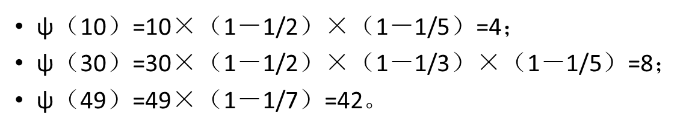

欧拉函数公式，性质，模板

<!-- more -->

# 欧拉函数

对正整数n，欧拉函数是小于n的正整数中与n互质的数的数目。例如φ(8)=4，因为1,3,5,7均和8互质。

### 欧拉函数公式

$$
euler(x) =x\times(1-\frac{1}{p_1})\times(1-\frac{1}{p_2})\times......\times(1-\frac{1}{p_n})
$$

*(其中p1, p2……pn为x的所有质因数，x是不为0的整数)*



**注意：**

`φ(1) = 1`（唯一和1互质的数(小于等于1)就是1本身）。 (注意：每种质因数只一个。比如 $$ 12 = 2\times2\times3 $$ 那么 $$ φ(12) = 12\times (1-\frac{1}{2}) \times (1-\frac{1}{3})=4  ) $$

### 性质

1. 当n为质数时，$φ(n)=n-1$。
2. 当$n=p^k$时（p是素数），$φ(n)=φ(p^k )=p^k-p^{k-1}=(p-1)p^{k-1}$
3. 若n,m互质，$φ(nm)=φ(n)φ(m)=(n-1)(m-1)$
4. 若n是奇数，则$φ(2n)=φ(n)$

**特殊性质**

1. 当a与n互质时(n>2)有:$a^{φ(n)}\  mod\ n=1$ (恒等于)此公式即 **欧拉定理**
2. 当a与n互质且n为质数时(即:gcd(a,n)=1)则上式有:$ a^{(n-1)}\ mod \ n=1$(恒等于)此公式即 **费马小定理**

### 延伸

小于n且与n互质的数的和：
$$
\frac{φ(n)∗n}2  (n>1)
$$

### 应用

**求$7^{222}$的个位数。**

因为7和10互质，且$φ(10)=4$

所以$7^4  mod 10=1$

所以$7^{222}  mod 10=7^{4∗55}∗7^2  mod 10=7^2  mod 10=9$

即$7^{222}  mod 10=7^{222\%4}  mod 10=7^2  mod 10=9$


### 模板

参考：

[https://www.cnblogs.com/wkfvawl/p/9317125.html](https://www.cnblogs.com/wkfvawl/p/9317125.html)

##### 直接求小于或等于n,且与n互质的个数

```c++
int  eular(int n)
{
    int i,ret=n;
    for(i=2; i<=sqrt(n); i++)
    {
        if(n%i==0)
        {
            ret=ret/i*(i-1);//这里先使用除法是为了防止溢出，ret=ret*(1-1/p(1))
            //为了完全消除我们已经除完了刚才得到的那个i因子,确保下一个得到的i是n的素因子
            while(n%i==0)
            {
                n/=i;
            }
        }
    }
    if(n>1)//可能还剩下一个素因子没有除 
    {
        ret=ret/n*(n-1);
    }
    return ret;
}
```

##### 筛选模板:求[1,n]之间每个数的质因数的个数

如果我们要求的数比较多，如果一个一个求那么很容易就超时，所以我们自然而然就想到——打表。

如果我们依照上述思想，来个最朴素的打表。

```c++
#define size 1000001
int euler[size];
void Init()
{
    euler[1]=1;
    for(int i=2; i<size; i++)
    {
        if(!euler[i])
        {
            for(int j=i; j<size; j+=i)
            {
                if(!euler[j])
                {
                    euler[j]=j;
                }
                euler[j]=euler[j]/i*(i-1);//先进行除法是为了防止中间数据的溢出
            }
        }
    }
}
```