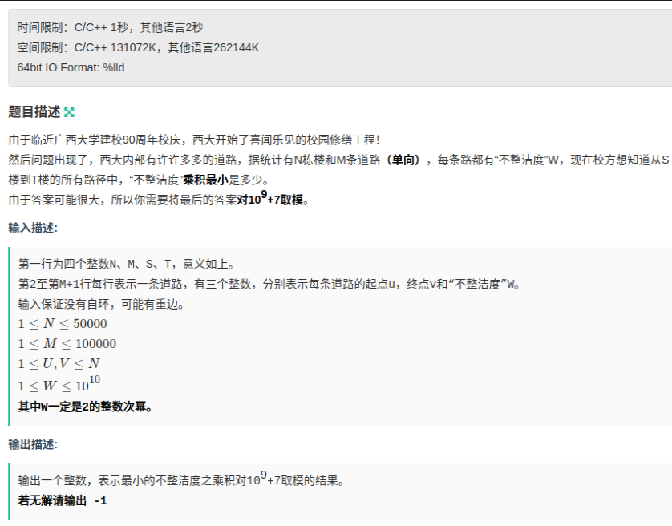
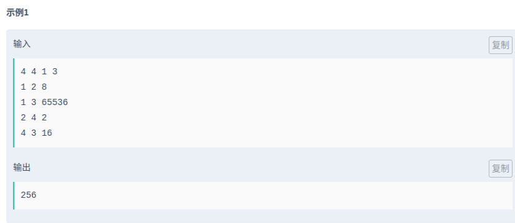

Dijkstra--链式向前星--快速幂
<!-- more -->

# 题目

链接：[牛客283H-图论一顿套模版](<https://ac.nowcoder.com/acm/contest/283/H>)





# 解析

题目求的是乘积，但是又因为**W一定是2的整数次幂。**所以我们可以将乘法换为加法，`2^x * 2^y = 2^(x+y)`

只要我们求出`x+y`的最小值，那么对应其答案也是最小值。算`2^x`可以运用快速幂解决

所以总体上我们可以用`dij+优先队列优化+链式向前星+快速幂解决`

```c++
/*
运行时间(ms)	使用内存(KB)	代码长度	使用语言	提交时间
62			   4188		     1543	    C++	       2019-03-28 10:53:59
*/
#include <cstdio>
#include <cstring>
#include <queue>
#include <cmath>
using namespace std;
typedef long long ll;
const int MOD = 1e9+7;
const int MAXN = 1e5+10;
const int INF = 0X3F3F3F3F;
struct Edge //链式向前星存图
{
    // to：表示这条边的另外一个顶点，next：指向下一条边的数组下标，值为-1表示没有下一条边
	int to, next; 
    //val：表示第i条边的值
	int val;
};

struct Node //优先队列节点，pos表示顶点位置，cost表示从起点到该点需要的最优路径长度
{
	int pos, cost;
	Node(){}
	Node(int pos, int cost):pos(pos),cost(cost){}
	friend bool operator <(const Node & a, const Node & b)
	{
		return a.cost > b.cost;
	}
};

//head[i]：表示顶点i的第一条边的数组下标，-1表示顶点i没有边
int head[MAXN];
//vis[i]：第i个点是否被访问
bool vis[MAXN];
int dis[MAXN];
Edge edge[MAXN];
int n, m, s, t;

int mod_pow(int x, int n) //快速幂
{
	int ans = 1;
	while(n)
	{
		if(n & 1)
			ans = ans*x%MOD;
		x = x*x%MOD;
		n >>= 1;
	}
	return ans;
}

void addEdge(int e1, int e2, int id, int val) //链式向前星建图
{
	edge[id].to = e2;
	edge[id].next = head[e1];
	head[e1] = id;
	edge[id].val = val;
}

void Dijkstra() 
{
	priority_queue<Node> q;
	Node p;
	dis[s] = 0;
	q.push(Node(s, 0));
	Edge e;
	while(!q.empty())
	{
		p = q.top();
		q.pop();
		if(vis[p.pos])
			continue;
		vis[p.pos] = true;
		for(int k = head[p.pos]; k != -1; k = edge[k].next)
		{
		    e = edge[k];
			if(dis[e.to] > dis[p.pos] + e.val)
			{
				dis[e.to] = dis[p.pos] + e.val;
				q.push(Node(e.to, dis[e.to]));
			}
		}
	}
}
int main()
{
	scanf("%d%d%d%d", &n, &m, &s, &t);
	memset(head, -1, sizeof(head));
	memset(vis, false, sizeof(vis));
	for(int i = 1; i <= n; i++)
		dis[i] = INF;
	int e1, e2, val;
	for(int i = 1; i <= m; i++)
	{
		scanf("%d%d%d", &e1, &e2, &val);
		addEdge(e1, e2, i,log2(val)); //取出2的几次幂后再存入图
	}
	Dijkstra();
	if(dis[t] == INF)
		printf("-1\n");
	else
		printf("%d\n",mod_pow(2,dis[t]));
	return 0;
}

```


