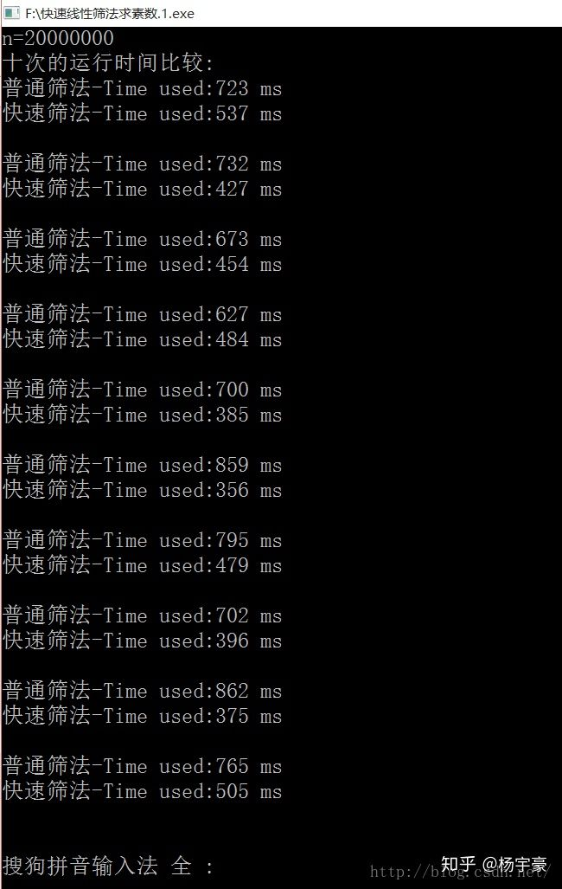

素数筛快速幂

<!-- more -->

# 素数筛

## 埃氏筛法---求解n以内的素数个数

```c++
int prime[MAXN]; //第i个素数的值
bool is_prime[MAXN]; //is_prime[i]为true时表示i是素数

//返回n以内素数的个数
int solve(int n)
{
    int p = 0; //代表素数个数
    for(int i = 2; i <= n; i++)
        is_prime[i] = true;
    for(int i = 2; i <= n; i++)
    {
        if(is_prime[i])
        {
            prime[p++] = i; //每有一个素数，p就++，然后prime存的就是素数的值，然后进行筛选
            for(int j = i * i; j <= n; j += i)
                is_prime[j] = false;
        }
    }
    return p; //prime[p - 1]代表n以内最大的素数
}
```

这种方法比较好理解，初始时，假设全部都是素数，当找到一个素数时，显然这个素数乘上另外一个数之后都是合数(注意上面的i\*i ,  比 i\*2 要快点 )，把这些合数都筛掉，即算法名字的由来。

但仔细分析能发现，这种方法会造成重复筛除合数，影响效率。比如10，在i=2的时候，k=2\*15筛了一次；在i=5，k=5\*6 的时候又筛了一次。所以，也就有了快速线性筛法。

## 快速线性筛法

```c++
#include<iostream>
using namespace std;    
const long N = 200000;   
long prime[N] = {0},num_prime = 0;    
int isNotPrime[N] = {1, 1};   
int main()    
{     
     	for(long i = 2 ; i < N ; i ++)       
       	{            
		if(!isNotPrime[i])               
	 		prime[num_prime++]=i;  
		//关键处1        
		for(long j = 0 ; j < num_prime && i * prime[j] <  N ; j ++)
    		{               
		      	isNotPrime[i * prime[j]] = 1;  
	  			if( !(i % prime[j] ) )  //关键处2                  
					break;           
			}    
		}        
	return 0;   
}
```

## 两者对比



由上述数据不难看出，快速线性筛法的效率基本比普通筛法求素数的效率高一倍，说明这的确是一种比较可靠的关于求素数优化的算法~！

参考:

[https://blog.csdn.net/dinosoft/article/details/5829550](https://blog.csdn.net/dinosoft/article/details/5829550)

[https://zhuanlan.zhihu.com/p/42609585](https://zhuanlan.zhihu.com/p/42609585)

# 快速幂，快速乘

参考：[https://blog.xehoth.cc/DurationPlan-modPow/#%E5%8D%81%E8%BF%9B%E5%88%B6%E5%BF%AB%E9%80%9F%E5%B9%82](https://blog.xehoth.cc/DurationPlan-modPow/#%E5%8D%81%E8%BF%9B%E5%88%B6%E5%BF%AB%E9%80%9F%E5%B9%82)

### 快速乘

普通快速幂在面对大量数据或单个够大数据时效率很低，这个时候我们就需要十进制快速幂，而如果模数是 `long long` 以内的数，我们可以用快速幂思想 *O*(log n)O(log n) 完成快速乘，但我们其实可以 *O*(1)完成。

利用 `long double`，而 `long double`的精度其实只有 19 位，直接乘是不行的，我们可以先除再乘，这样就不会出现精度问题，而前面直接计算 *a*×*b*，再减去后面的部分，即使前面 *a*×*b* 爆负，它还会再爆一遍变为正的，保证了答案的正确。

```c++
typedef long double ld;
typedef long long ll
inline ll mul(ll a, ll b) 
{
    return (a * b - (ll)((ld)a / MOD * b) * MOD + MOD) % MOD;
}
```

### 二进制快速幂

**基本代码，都懂**

```c++
typedef long long ll;
ll mod_pow(ll x, ll n, ll mod) //x^n % mod
{
    ll ans = 1;
    while(n > 0) //遍历所有二进制位
    {
        if(n & 1) //对应n的二进制位是不是1
            ans = ans * x % mod; //乘上x^(2^i)
        x = x * x % mod;  //x平方
        n >>= 1;
    }
    return ans;
}
```

**蜜汁优化版本（参考ext/numeric.h的power函数）**

```c++
inline long optimizedModPow(long a, long b) {
    if (b == 0) return 1;
    for (; ~b & 1; b >>= 1, a = mul(a, a));
    register long ret = a;
    for (b >>= 1; b; b >>= 1)
        a = mul(a, a), (b & 1) ? ret = mul(a, ret) : 0;
    return ret;
}
//balabala--看不懂系列！！
```

### 十进制快速幂

说白了就是拆成十进制数