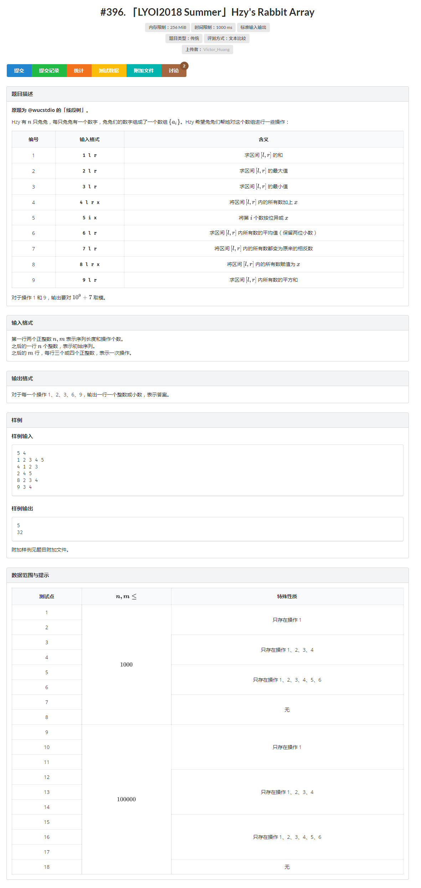

「LYOI2018 Summer」Hzy's Rabbit Array                

<!-- more -->

参考：

[wyy603](https://wyy603.github.io/2019/01/07/%E7%BA%BF%E6%AE%B5%E6%A0%91%E6%A8%A1%E6%9D%BF/)

# [「LYOI2018 Summer」Hzy's Rabbit Array](https://lyoi.ac/problem/396)                



```c++
#include <cstdio>
#include <climits>

#define MAXN 500005
// 需要加的宏（模数可自行更改）
#define MOD 1000000007
typedef long long ll;
#define min(a, b) (((a) < (b)) ? (a) : (b))
#define max(a, b) (((a) > (b)) ? (a) : (b))

inline ll read()
{
    char c = getchar();
    ll ret = 0;
    while (c < '0' || c > '9') c = getchar();
    while (c >= '0' && c <= '9') 
        ret = ret * 10 + c - '0', c = getchar();
    return ret;
}

// 线段树的辅助函数和结构体
inline ll sqr(ll x)
{
    return ((x % MOD) * (x % MOD)) % MOD;
}

template <typename T>
void swap(T& a, T& b)
{
	T t = a;
	a = b, b = t;
}

int N, M;
// 描述初始序列
ll begin[MAXN];

// 线段树的辅助函数和结构体
struct nod
{
    ll sum, mx, mn, squ;
    double dsum;
    nod (ll isum, ll imx, ll imn, ll isqu, double idsum)
    {
        sum = isum, mx = imx, mn = imn, 
        squ = isqu, dsum = idsum;
    }
};

// 线段树主体
struct sgt
{
    ll sum, mx, mn, squ, add, cov, mul;
    double dsum;
    int l, r, mid, siz;
    sgt *lson, *rson;
    sgt (int le, int ri)
    {
        l = le, r = ri, mid = (l + r) >> 1, siz = r - l + 1;
        lson = rson = NULL, sum = mx = mn = squ = 0, 
        add = 0, mul = 1, cov = -1, dsum = 0;
    }
    void push_up()
    {
        sum = (lson->sum + rson->sum) % MOD;
        mx = max(lson->mx, rson->mx);
        mn = min(lson->mn, rson->mn);
        squ = (lson->squ + rson->squ) % MOD;
        dsum = lson->dsum + rson->dsum;
    }
    void plus(ll K)
    {
        squ = (squ + (((2 * (K % MOD)) % MOD) * sum) % MOD 
               + (sqr(K) * siz) % MOD) % MOD;
        sum = (sum + ((K % MOD) * siz) % MOD) % MOD;
        mx += K, mn += K, dsum += K * siz;
        add = add + K;
    }
    void multiply(ll K)
    {
        squ = (squ * sqr(K)) % MOD, sum 
            = (sum * (K % MOD)) % MOD, dsum *= K;
		mx *= K, mn *= K;
		if (K < 0) swap(mx, mn);
        mul = mul * K, add = add * K;
    }
    void cover(ll K)
    {
        squ = (sqr(K) * siz) % MOD, sum = ((K % MOD) * siz) % MOD;
        mx = mn = K, dsum = K * siz;
        cov = K, mul = 1, add = 0;
    }
    void push_down()
    {
        if (cov != -1) lson->cover(cov), rson->cover(cov), cov = -1;
        if (mul != 1) lson->multiply(mul), rson->multiply(mul), mul = 1;
        if (add) lson->plus(add), rson->plus(add), add = 0;
    }
    void build()
    {
        if (l >= r) sum = begin[l] % MOD, squ = sqr(begin[l]), 
        	mx = begin[l], mn = begin[l], dsum = begin[l];
        else lson = new sgt(l, mid), rson = new sgt(mid + 1, r), 
        	lson->build(), rson->build(), push_up();
    }
    void modify(int L, int R, ll K, char t)
    {
        if (l == L && r == R)
        {
            if (t == 'p') plus(K);
            else if (t == 'm') multiply(K);
            else if (t == 'c') cover(K);
        }
        else
        {
            push_down();
            if (R <= mid) lson->modify(L, R, K, t);
            else if (L > mid) rson->modify(L, R, K, t);
            else lson->modify(L, mid, K, t), rson->modify(mid + 1, R, K, t);
            push_up();
        }
    }
    nod query(int L, int R)
    {
        if (l == L && r == R) return nod(sum, mx, mn, squ, dsum);
        else
        {
            push_down();
            if (R <= mid) return lson->query(L, R);
            else if (L > mid) return rson->query(L, R);
            else
            {
                nod ls = lson->query(L, mid), rs = rson->query(mid + 1, R);
                return nod((ls.sum + rs.sum) % MOD, max(ls.mx, rs.mx), 
                           min(ls.mn, rs.mn), (ls.squ + rs.squ) % MOD, ls.dsum + rs.dsum);
            }
        }
    }
}*hed;
// 线段树主体

int main()
{
    #ifndef ONLINE_JUDGE
    freopen("input.in", "r", stdin);
    freopen("output.out", "w", stdout);
    #endif
	
    N = read(), M = read();
    int i;
    for (i = 1; i <= N; ++i) begin[i] = read();
    hed = new sgt(1, N), hed->build();
    ll opt, p1, p2, p3, t;
    for (i = 1; i <= M; ++i)
    {
        opt = read(), p1 = read(), p2 = read();
        if (opt == 1) printf("%lld\n", (hed->query(p1, p2).sum % MOD + MOD) % MOD);
        else if (opt == 2) printf("%lld\n", hed->query(p1, p2).mx);
        else if (opt == 3) printf("%lld\n", hed->query(p1, p2).mn);
        else if (opt == 4) hed->modify(p1, p2, read(), 'p');
        else if (opt == 5) t = hed->query(p1, p1).mx, t = t ^ p2, hed->modify(p1, p1, t, 'c');
        else if (opt == 6) printf("%.2lf\n", hed->query(p1, p2).dsum / (double)(p2 - p1 + 1));
        else if (opt == 7) hed->modify(p1, p2, -1, 'm');
        else if (opt == 8) hed->modify(p1, p2, read(), 'c');
        else if (opt == 9) printf("%lld\n", (hed->query(p1, p2).squ % MOD + MOD) % MOD);
    }
    return 0;
}

```

实现方式：指针；动态申请内存；普通线段树

注意事项：区间和/区间平方和 被模了；区间最大值/最小值 没模。建议每次操作的参数不要超过long long的取值范围，并保证最大值在long long范围内。（如果想让它们被模可自行更改）

### 这颗线段树的使用方法

1. 在使用之前（最开头）

```c++
read_to_begin();
hed = new sgt(1, N);
hed->build();
```

其中read_to_begin();要将初始序列读入begin**数组**

2. 使用时

```c++
hed->modify(l, r, k, 'p'); //区间加
hed->modify(l, r, k, 'm'); //区间乘
hed->modify(l, r, k, 'c'); //区间赋值
```

其中l, r表示一个闭区间[l,r]，k表示参数

```c++
hed->query(l, r);
```

返回一个nod形变量，如果这个返回值是t，那么

- t.sum是区间和（模了）
- t.mx是区间最大值（没模）
- t.mn是区间最小值（没模）
- t.squ是区间平方和（模了）


