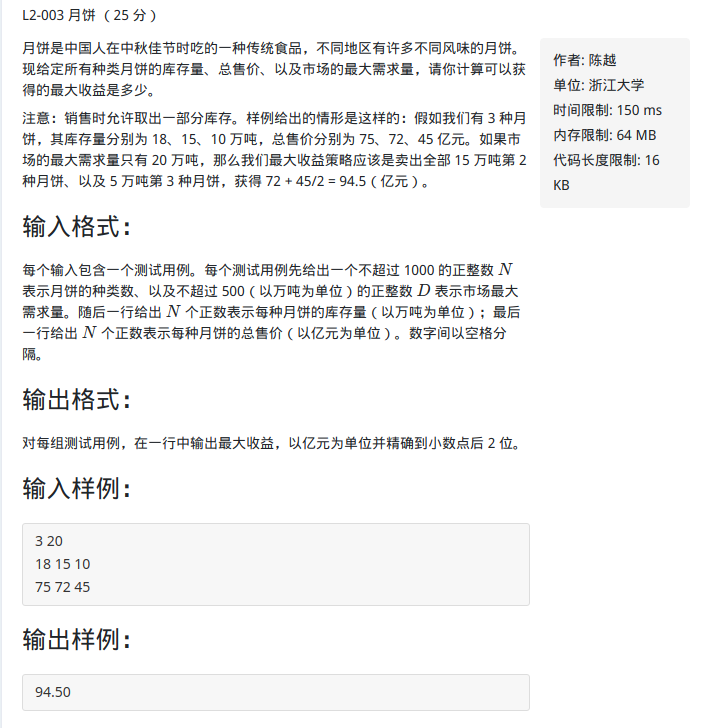

部分背包，01背包，完全背包，多重背包

<!-- more -->

- 部分背包问题和01背包问题的区别就是：部分背包问题中的单个物品，可以取一部分装入背包。而0/1背包问题则是要么全部拿走，要么一无所有

- 完全背包与0-1背包问题的区别是：在0-1背包问题中，每个物品仅有一件；在完全背包问题中，每个物品有无限件
- 多重背包与完全背包问题的区别是：在完全背包问题中，每个物品有无限件；在多重背包问题中，每个物品有Mi件
- 混合背包问题相当于上面提到所有背包问题的混合：有的物品仅有1件，有的物品有无限件，有的物品有Mi件（有限件）

# 部分背包

【部分背包】问题描述：n件物品，第i件物品价值 vi 元，重wi 磅。希望用 W磅的背包 拿走最重的物品。第i件物品可以都拿走，也可以拿走一部分。（物品可以分割所以称为部分背包）

因为每一个物品都可以分割成单位块，单位块的利益越大显然总收益越大，所以它局部最优满足全局最优，可以用贪心法解答。 
（1）先将单位块收益按从大到小进行排序； 
（2）初始化背包的剩余体积和当前价值； 
（3）从前到后考虑所有物品：a.如果可以完全放入，当前价值加上物品总价值，剩余体积减去物品总体积；b.如果可以部分放进，当前价值加上物品价值*剩余体积，使剩余体积为0.

## 模板题[L2-003 月饼](https://pintia.cn/problem-sets/994805046380707840/problems/994805071789801472)



```c++
#include <bits/stdc++.h>
using namespace std;

const int MAXN = 1e4;
struct node
{
    double w, v;
}stru[MAXN];
int dp[MAXN] = {0};
double arr[MAXN] = {0};
bool cmp(node x, node y)
{
    return x.v/x.w > y.v/y.w;
}
int main()
{
    int n, d;
    cin >> n >> d;
    for(int i = 0; i < n; i++)
        cin >> stru[i].w;
    for(int i = 0; i < n; i++)
        cin >> stru[i].v;
    sort(stru, stru + n, cmp);

    int i, j;
    for(i = 0; i < n; i++)
    {
        if(stru[i].w > d)
            break;
        d -= stru[i].w;
        arr[i] = 1.0;
    }
    if(i < n)
        arr[i] = d / stru[i].w;
    double ans = 0;
    for(j = i; j >= 0; j--)
        ans += stru[j].v*arr[j];
    printf("%0.2lf", ans);

    return 0;
}
```

# 01背包

## 入门

[动态规划专题 01背包问题详解【转】 - fancy_boy - 博客园](www.cnblogs.com/fancy-itlife/p/4393213.html)

[二维背包](https://blog.csdn.net/fx677588/article/details/68951593)

[一维背包](https://blog.csdn.net/qq_33279781/article/details/52073519)

## 初始化细节

我们看到的求最优解的背包问题题目中，事实上有两种不太相同的问法。有的题目要求“恰好装满背包”时的最优解，有的题目则并没有要求必须把背包装满。一种区别这两种问法的实现方法是在初始化的时候有所不同。

如果是第一种问法，要求恰好装满背包，那么在初始化时除了f[0]为0其它f[1..V]均设为-∞，这样就可以保证最终得到的f[N]是一种恰好装满背包的最优解。

如果并没有要求必须把背包装满，而是只希望价格尽量大，初始化时应该将f[0..V]全部设为0

为什么呢？可以这样理解：初始化的f数组事实上就是在没有任何物品可以放入背包时的合法状态。如果要求背包恰好装满，那么此时只有容量为0的背包可能被价值为0的nothing“恰好装满”，其它容量的背包均没有合法的解，属于未定义的状态，它们的值就都应该是-∞了。如果背包并非必须被装满，那么任何容量的背包都有一个合法解“什么都不装”，这个解的价值为0，所以初始时状态的值也就全部为0了。
这个小技巧完全可以推广到其它类型的背包问题，后面也就不再对进行状态转移之前的初始化进行讲解。

## 题目

### 模板题-HDU2602-Bone Collector

[HDU2602](http://acm.hdu.edu.cn/showproblem.php?pid=2602)

```C++
#include <iostream>
#include <algorithm>
using namespace std;
const int len = 10000;

int main()
{
    ios::sync_with_stdio(false);
    int t;
    cin >> t;
    while(t--)
    {
        int n, m;
        cin >> n >> m;
        int dp[len] = {0}, val[len] = {0}, w[len] = {0}; 	//val价值 w体积
        for(int i = 1; i <= n; i++)
            cin >> val[i];
         for(int i = 1; i <= n; i++)
            cin >> w[i];
        for(int i = 0; i <= n; i++)
            for(int j = m; j >=w[i]; j--)
        {
            dp[j] = max(dp[j], dp[j - w[i]] + val[i]);
        }
        cout << dp[m] << endl;
    }
    return 0;
}
```

### 01变形-HDU2546-饭卡

[hdu2546](http://acm.hdu.edu.cn/showproblem.php?pid=2546)

比较详细的解析:[动态规划专题 01背包问题详解 HDU 2546 饭卡 - fancy_boy - 博客园](https://www.cnblogs.com/fancy-itlife/p/4394398.html)

```c++
#include <iostream>
#include <algorithm>
using namespace std;
const int len = 1005;

int main()
{
    int n, m;
    while(cin >> n&& n != 0)
    {
        int w[len] = {0};	//w:菜的价格
        int dp[len] = {0};
        for(int i = 1; i <= n; i++)
            cin >> w[i];
        int m;
        cin >> m;
        if(m <= 4)	//余额小于4，什么都不能购买，直接输出
            cout << m << endl;
        else
        {
            sort(w + 1, w + n + 1); //排序后将最大的留到最后减，将m-1个进行01背包求解
            for(int i = 1; i <= n - 1; i++)
                for(int j = m - 5; j >= 0; j--)
                {       
                    if(j >= w[i]) 
                    {
                        dp[j]= max(dp[j], dp[j - w[i]] + w[i]);
                    }
                }
            int s = 0;
            for(int j = 1; j <= m-5; j++)
            {
                if(s<dp[j])
                    s=dp[j];
            }  //挑出花销最大的                
            cout << m - s - w[n] << endl; 
        }
    }
    return 0;
}
```

### 01变形-nyoj860-用价值保存质量

[nyoj860 又见01背包](https://blog.csdn.net/sinat_26019265/article/details/51057698)

### hdu2639（01背包求第k优解）

题目：[HDU2639-Bone Collector II](http://acm.hdu.edu.cn/showproblem.php?pid=2639)

题解：[csdn](https://blog.csdn.net/martinue/article/details/51427171)

```c++
#include <iostream>
#include <cstring>
using namespace std;

const int len = 1000;
int val[len], cost[len], dp[len][len];

int main()
{
    ios::sync_with_stdio(false);
    int t;
    cin >> t;
    while(t--)
    {
        int n, v, k;    //n个物品，体积为v，求解第k个最优值
        cin >> n >> v >> k;
        for(int i = 1; i <= n; i++)
            cin >> val[i];
        for(int i = 1; i <= n; i++)
            cin >> cost[i];
        memset(dp, 0, sizeof(dp));
        for(int i = 1; i <= n; i++)
            for(int j = v; j >= cost[i]; j--)
            {
                int A[len], B[len];
                for(int kk = 1; kk <= k; kk++)
                {
                    A[kk] = dp[j - cost[i]][kk] + val[i];
                    B[kk] = dp[j][kk];
                    //选择与不选择
                }
                int a = 1, b = 1, c = 1;
                A[k + 1] = -1, B[k + 1] = -1; //结束循环的一个标志
                while(c <= k && (A[a] != -1 || B[b] != -1)) //排序过程，当有一个到达地K+1项停止
                {
                    if(A[a] > B[b])
                        dp[j][c] = A[a++];
                    else
                        dp[j][c] = B[b++];
                    if(dp[j][c] != dp[j][c - 1])
                        c++;    //这里是为了防止相同的数也占用，有可能有几个相同的结果但它们只能有一个名次而已
                }
            }
        cout << dp[v][k] << endl;
    }
    return 0;
}


```

### 限制条件的01背包

[hdu5188](https://blog.csdn.net/u011663071/article/details/44307273)

### 01变形-洛谷P1802

参考题解: [半仙胡小桃](https://www.luogu.org/space/show?uid=19842) 

一个变形版的01背包。  

dp[i]表示用i瓶药获得的最多经验。  

决策？

当i>=use时，可以选择打败或者不打败

dp[i]=max(dp[i]+lose,dp[i-use]+win)。

当i<use时，无法战胜对方。

dp[i]+=lose

至于数据范围，最后输出时强制转换一下就行了。(这里需要long long)

题目：[P1802](https://www.luogu.org/problemnew/show/P1802)

```c++
#include <iostream>
#include <algorithm>
using namespace std;
const int len = 100000;
typedef long long ll;
ll dp[len];
ll win[len],lose[len],use[len];
int main()
{
    int n,m;
    cin >> n >> m;
    for(int i = 1; i <= n; i++)
     cin >> lose[i] >> win[i] >> use[i];
    for(int i = 1; i <= n; i++)
     {
         for(int j = m; j >= use[i]; j--)
            dp[j] = max(dp[j] + lose[i], dp[j - use[i]] + win[i]);
         for(int j = use[i] - 1;j >= 0; j--)
            dp[j] += lose[i];
     }
     cout << 5 * dp[m];
     return 0;
}
```

### P1757 通天之分组背包

题目：[p1757](https://www.luogu.org/problemnew/show/P1757)

这一题是分组背包问题。思路是把每一组看做一个物品，转化为01背包做。  

对于分组背包，可以这样想：虽然分成很多组，但只能选一个，或者不选，这和01背包是一样的，也就是说，对于01背包里每一个独一无二的物品，对应的分组背包就是每一组中选择一个物品，这样来看，完全就是01背包问题。  

可以想一下01背包的状态方程，和这个外两层的循环是一样的，不一样的是里面又加了一层，这层循环是遍历每一组的物品用的，对于dp[]中每一个状态都是循环了一遍每一组的物品才换到下一个的，所以对后面的没有影响，也就保证了每组物品最多只有一件。

```c++
#include <iostream>
#include <algorithm>
using namespace std;

int w[1100] = {0};    //重量
int v[1100] = {0};    //价值
int num[1100][1100] = {0};//用来记录编号的数组，按照输入的顺寻调用所对应的w、v
int dp[1100];
int main()
{
    int m ,n, g;
    cin >> m >> n;
    int Maxg = 0; //最大组数
    for(int i = 1; i <= n; i++)
    {
        cin >> w[i] >> v[i] >> g;
        Maxg = max(Maxg, g);
        num[g][++num[g][0]] = i; //p组每有个物品第二维数量就加一并且记下是第几个
    }
    for(int i = 1; i <= Maxg; i++) //组数
        for(int j = m; j >= 0; j--) //容量
            for(int k = 1; k <= num[i][0]; k++) //各组中物品的序号
                if(j >= w[num[i][k]])
                    dp[j] = max(dp[j], dp[j - w[num[i][k]]] + v[num[i][k]]);
    cout << dp[m];
    return 0;
}

```


### HDU2955

### HDU3466

### HDU1881

# 完全背包

[动态规划之完全背包详解](http://www.cnblogs.com/Kalix/p/7622102.html)

## [hdu 1114 Piggy-Bank（完全背包）](http://acm.hdu.edu.cn/showproblem.php?pid=1114)

大意：给出存钱罐本身的重量和装钱后的重量，以及存钱罐中钱的面值和重量，求存钱罐装满时，钱的总和最小是多少

```c++
/*
 Judge Status : Accepted	 Language : C++
 Submit Time：2018-08-15 12:32:04	
 Exe.Time:46MS	 Exe.Memory：1828k
*/

#include <iostream>
#include <algorithm>
using namespace std;
const int INF = 1E9;
const int MAXN = 1E5 + 100;
int dp[MAXN];
int weight[MAXN], value[MAXN];

void init()
{
    for(int i = 1; i < MAXN; i++)
        dp[i] = INF;
}

int main()
{
    ios::sync_with_stdio(false);
    int t;
    cin >> t;
    while(t--)
    {
        int empty, full;
        cin >> empty >> full;
        int V = full -empty;
        int n;
        cin >> n;
        init();
        for(int i = 1; i <= n; i++)
            cin >> value[i] >> weight[i];
        for(int i = 1; i <= n; i++)
            for(int j = weight[i]; j <= V; j++)
                dp[j] = min(dp[j - weight[i]] + value[i], dp[j]);
        if(dp[V] == INF)
            cout << "This is impossible." << endl;
        else
            cout << "The minimum amount of money in the piggy-bank is "
                << dp[V] << "." << endl;
    }
    return 0;
}
```

# 多重背包

[HDU2191-悼念512汶川大地震遇难同胞——珍惜现在，感恩生活](http://acm.hdu.edu.cn/showproblem.php?pid=2191)

此题当中是把重量当成每件物品的价值。把总的钱数当成背包的容量。

```c++
/*
 Judge Status : Accepted	 Language : C++
 Submit Time：2018-08-25 11:04:19		
 Exe.Time:0MS	 Exe.Memory：1428KB
*/
#include <iostream>
#include <cstring>
#include <algorithm>

using namespace std;

const int MAXN = 1e2 + 10;
int cntValue, cntKind, value[MAXN], weight[MAXN], bag[MAXN], dp[MAXN]; //bag--每个物品的数量

int main()
{
    ios::sync_with_stdio(false);
    int t;
    cin >> t;
    while(t--)
    {
        memset(dp, 0, sizeof(dp));
        cin >> cntValue >> cntKind;
        for(int i = 0; i < cntKind; i++)
            cin >> value[i] >> weight[i] >> bag[i];
        for(int i = 0; i < cntKind; i++)
            for(int j = 0; j < bag[i]; j++)
                for(int k = cntValue; k >=value[i]; k--)
                    dp[k] = max(dp[k], dp[k - value[i]] + weight[i]);
        cout << dp[cntValue] << endl;
    }
    return 0;
}
```

