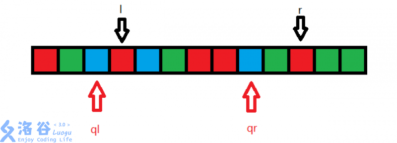
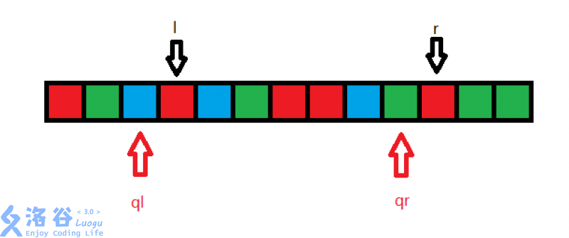
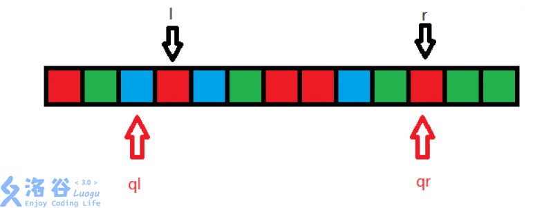
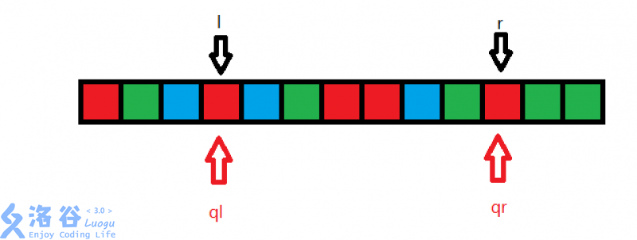
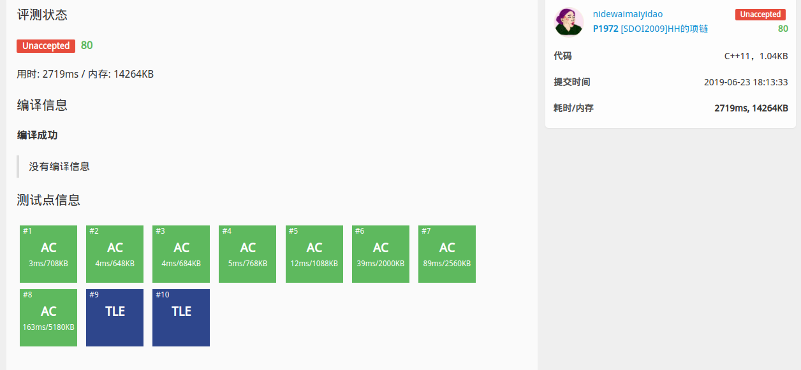

莫队算法

<!-- more -->

# 简述

莫队算法使用分块的思想，可以解决一类离线区间询问问题

莫队算法（`mo's algorithm`）一般分为两类，一是莫队维护区间答案，二是维护区间内的数据结构。当然也有树上莫队，带修改莫队、二维莫队等等

# 普通莫队

莫队的精髓就在于，离线得到了一堆需要处理的区间后，合理的安排这些区间计算的次序以得到一个较优的复杂度。

我们考虑一个问题，给一个序列，m次询问，每次询问你区间$[l,r]$有多少种不同的颜色。 $n,m\leq 100000n,m≤100000$

先考虑暴力，对每次询问遍历一遍 $[l,r]$，这样是$O(nm)$的

---

换种方式暴力，定义ql和qr，表示区间 $[ql,qr]$内有多少颜色，再定义cnt数组， 表示第i种颜色在区间 $[ql,qr]$出现了多少次。那么现在的情况就是已经 $[ql,qr]$的答案，需要我们去转移求$[l,r]$区间的答案

因为这个是莫队算法的基础，所以模拟一下这个过程：



我们的初始在这个状态，假设蓝色为1，红色为2，绿色为3，区间$[ql,qr]$有

那么$cnt_1=3, cnt_2=3, cnt_3=1$，然后我们把qr向右移动




这样多了一个绿色，$cnt_3$的值+1，继续移动



多了一个红色，$cnt_2$的值+1

此时我们发现，我们的右指针已经和询问的右端点重合了，接下来移动ql



少了个蓝色，$cnt_1-1$

所以得到答案为$cnt_1=2, cnt_2=4, cnt_3=2$

这部分代码可表示为

```c++
inline void add(int x){
    cnt[x]++;
    //ans为不同颜色答案数
    if(cnt[x]==1)ans++;
}

inline void del(int x){
    cnt[x]--;
    if(cnt[x]==0)ans--;
}

//待求左区间比原区间小，则需要将原区间左指针左移，颜色块变多，那么就需要加值，其他同样
while(l>ql) add(a[--l]);
while(r<qr) add(a[++r]);
while(l<ql) del(a[l++]);
while(r>qr) del(a[r--]);
```

我们发现，每次挪动都都是$O(1)$的，每次询问我们最多要移动n次，所以时间复杂度还是$O(nm)$。

我们有没有办法来加速呢？

这种暴力的耗时就耗在移动次数上，我们要让他移动的次数尽量少

最直接的一个想法就让每个所求区间尽量靠近，那么我们就可以减少了移动次数。

---

一种直观的办法是按照左端点排序，再按照右端点排序。但是这样的表现不好。特别是面对精心设计的数据，这样方法表现得很差。

举个例子，有6个询问如下：(1, 100), (2, 2), (3, 99), (4, 4), (5, 102), (6, 7)

这个数据已经按照左端点排序了。用上述方法处理时，左端点会移动6次，右端点会移动移动`98+97+95+98+95=483`次。右端点大幅度地来回移动，严重影响了时间复杂度

其实我们稍微改变一下询问处理的顺序就能做得更好：(2, 2), (4, 4), (6, 7), (5, 102), (3, 99), (1, 100)

左端点移动次数为`2+2+1+2+2=9`次，比原来稍多。右端点移动次数为`2+3+95+3+1=104`，右端点的移动次数大大降低了。

所以，在排序时，我们并不是按照左右端点严格升序排序询问，而只是令其左右端点处于“大概是升序”的状态。具体的方法是，**把所有的区间划分为不同的块，将每个询问按照左端点的所在块序号排序，左端点块一样则按照右端点排序。**

```c++
bool cmp(query a,query b){
return (a.r/block)==(b.r/block)?a.l<b.l:a.r<b.r;
}
```

有一种更快的排序，据说是这样能快是因为指针移到右边后不用再跳回左边，而跳回左边后处理下一个块又要跳回右边，这样能减少一半操作，理论上能快一倍

```c++
bool cmp(node a,node b){
return pos[a.l]^pos[b.l]?pos[a.l]<pos[b.l]:pos[a.l]&1?a.r<b.r:a.r>b.r;
}
```

---

**所以其基本思路为：按照分块思想，将区间分块，接着将每个询问按照块序号排序（一样则按照右端点排序）。之后，我们从排序后第一个询问开始，逐个计算答案。**

设区间长度为n，询问m次，那么莫队时间复杂度是$O(m\sqrt{n})$

# [P1972 [SDOI2009]HH的项链](https://www.luogu.org/problemnew/show/P1972)


因为这道题加强了数据卡莫队，所以会t两个点，但是拿来写裸莫队还是可以的



```c++
#include<bits/stdc++.h>
using namespace std;

const int MAXN = 500005;
int arr[MAXN], block, ans = 0, Ans[MAXN], cnt[1000005];

struct node
{
    int l, r, id;
}q[MAXN];

inline bool cmp(node a,node b)
{
    return(a.l/block)^(b.l/block)?a.l<b.l:(((a.l/block)&1)?a.r<b.r:a.r>b.r);
}

inline void add(int x)
{
    if(!cnt[arr[x]]) ans++;
    cnt[arr[x]]++;
}
inline void del(int x)
{
    cnt[arr[x]]--;
    if(!cnt[arr[x]]) ans--;
}

int main()
{
    int n, m;
    scanf("%d", &n);
    for(int i = 1; i <= n; i++)
        scanf("%d", &arr[i]);
    scanf("%d", &m);
    block = sqrt(n);
    for(int i = 1; i <= m; i++)
    {
        scanf("%d", &q[i].l);
        scanf("%d", &q[i].r);
        q[i].id = i;
    }
    sort(q+1, q+m+1, cmp);
    int l = 0, r = 0;
    for(int i = 1; i <= m; i++)
    {
        int ql = q[i].l, qr = q[i].r;
        while(l<ql)del(l++);
        while(l>ql)add(--l);
        while(r<qr)add(++r);
        while(r>qr)del(r--);
        Ans[q[i].id] = ans;
    }
    for(int i = 1; i <= m; i++)
        printf("%d\n", Ans[i]);
    return 0;
}
```

# 带修改的莫队

普通的莫队只能解决没有修改的问题，那么带修改的问题怎么解决呢？带修莫队就是一种支持单点修改的莫队算法。

在进行修改操作的时候，修改操作是会对答案产生影响的(废话)

那么我们如何避免修改操作带来的影响呢？

---

它与普通莫队不同的是，多了一个时间戳，用来记录到当前这个询问时已经进行了多少次修改操作。

我们把询问和修改分别存下来。对于每一个询问，我们不仅要做到左右端点与当前询问一致，还要使修改次数与当前询问相同。如果我们修改得过多，那么应该删去多余的修改，修改过少则反之。

比如，我们现在已经进行了3次修改，本次查询是在第5次修改之后，那我们就执行第4,5次修改

这样就可以避免修改操作对答案产生的影响了

因为莫队是离线查询，需要先读取全部需要查询的区间再开始处理的，有修改的话，就类似于普通莫队那样左右移动端点，所以我们可以加一个时间戳，也让时间戳同步于左右端点进行移动。这样的话我们就需要对时间戳进行处理，让结果最优。

带修莫队在原来四个while循环的基础上加了两个while循环处理时间戳。

分块的话`block = pow(n, 0.6666666666);`这样比较好

# [P1903 [国家集训队]数颜色 / 维护队列](https://www.luogu.org/problemnew/show/P1903)


```c++
/*
代码 C++11，1.9KB
提交时间 2019-06-28 11:44:21
耗时/内存 6414ms, 9876KB
*/
#include<bits/stdc++.h>
using namespace std;

const int MAXN = 500005;
int arr[MAXN], block, ans = 0, cntQ = 0, cntR = 0, cnt[1000005], Ans[MAXN];
int where[MAXN];

struct node
{
    //l = 左端点，r = 右端点，t = 已修改次数（时间戳），id = 询问编号
    int l, r, id, t;
}q[MAXN];

struct Update
{
    int pos, k; //把第 pos 个数变为 k
}u[MAXN];


inline bool cmp(node x, node y)
{
    if (x.l / block != y.l / block)
        return x.l < y.l;
    else if (x.r / block != y.r / block)
        return ((x.l / block) & 1) ? x.r < y.r : x.r > y.r;
    return x.t < y.t;
}
void add(int x)
{
    if(++cnt[x] == 1)
        ans++;
}

void del(int x)
{
    if(--cnt[x] == 0)
        ans--;
}

void upd(int now, int i) //在第 i 个询问进行第 now 次修改
{
    if(u[now].pos >= q[i].l && u[now].pos <= q[i].r) //修改的位置在询问区间内才会产生影响 
    {
        del(arr[u[now].pos]); //删掉第 pos 位上的数 
        add(u[now].k); //增加修改完的数 
    }
    //如果我们这一次修改把 x 变成了 y，下次如果要改回来就不是把 x 变成 y 了，
    //而是应当把 y 变成 x，所以我们修改完后我们要把 x 和 y 交换
    swap(arr[u[now].pos], u[now].k);
}

void mo()
{
    sort(q+1, q+cntQ+1, cmp);
    int l = 1, r = 0, now = 0; //初始左端点为 1，右端点为 0，进行了 0 次修改
    for(int i = 1; i <= cntQ; i++)
    {
        int ql = q[i].l, qr = q[i].r, qt=q[i].t;
        while(l>ql)add(arr[--l]);
        while(r<qr)add(arr[++r]);
        while(l<ql)del(arr[l++]);
        while(r>qr)del(arr[r--]);
        while(now<qt) upd(++now, i);
        while(now>qt) upd(now--, i);
        Ans[q[i].id] = ans;
    }
}
int main()
{
    int n, m;
    scanf("%d %d", &n, &m);
    for(int i = 1; i <= n; i++)
        scanf("%d", &arr[i]);
    block = pow(n, 0.6666666666);
    char op;
    int l, r;
    for(int i = 1; i <= m; i++)
    {
        getchar();
        scanf("%c %d %d", &op, &l, &r);
        if(op == 'Q')
        {
            cntQ++; //记录共 cntQ 个查询
            q[cntQ].l = l;
            q[cntQ].r = r;
            q[cntQ].t = cntR;
            q[cntQ].id = cntQ;
        }
        else
        {
            cntR++; //记录共 cntR 个修改 
            u[cntR].pos = l;
            u[cntR].k = r;
        }
    }
    mo();
    for(int i = 1; i <= cntQ; i++)
        printf("%d\n", Ans[i]);
    return 0;
}
```


参考：

[莫队算法初探 - #include<codesonic> - 洛谷博客](https://www.luogu.org/blog/codesonic/Mosalgorithm)

[莫队算法 (Mo's Algorithm) - 知乎](https://zhuanlan.zhihu.com/p/25017840)

[莫队算法良心讲解 - 张瑯小强 - 博客园](https://www.cnblogs.com/CsOH/p/5904430.html)

[莫队、带修莫队、树上莫队详解 | ouuan的博客](https://ouuan.github.io/%E8%8E%AB%E9%98%9F%E3%80%81%E5%B8%A6%E4%BF%AE%E8%8E%AB%E9%98%9F%E3%80%81%E6%A0%91%E4%B8%8A%E8%8E%AB%E9%98%9F%E8%AF%A6%E8%A7%A3/)

[带修改莫队算法 - 自为风月马前卒 - 博客园](https://www.cnblogs.com/zwfymqz/p/7154145.html)

[「Luogu P1903」「国家集训队」数颜色/维护队列 | Heartlessly's Blog](https://heartlessly.github.io/problems/luogu-p1903/)

[莫队算法、及带修改操作的莫队算法 - CaptainChen的博客 - CSDN博客](https://blog.csdn.net/can919/article/details/79393546)