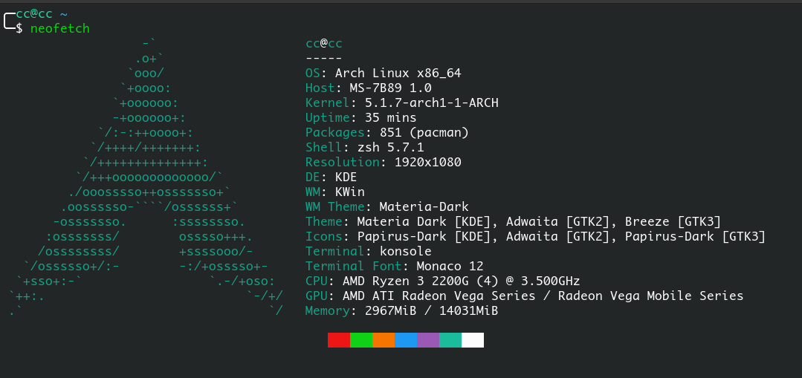

迁移sata固态硬盘中的arch到空的nvme固态硬盘里面

<!-- more -->

# 分区

**记原本sata固态硬盘为/dev/sda，nvme固态固态为/dev/nvme**

原sata硬盘分区为，启动方式为uefi

```
/         --> /dev/sda1
/home     --> /dev/sda2
swap      --> /dev/sda3
/boot/efi --> /dev/sda4
```

则我们需要在新的nvme固态硬盘同样分四个区，并且分别格式化为对应的格式，新的硬盘分区不能小于旧的硬盘分区。

那么迁移过来我们的分区如下：

```
/         --> /dev/nvme1 (ext4)
/home     --> /dev/nvme2 (ext4)
swap      --> /dev/nvme3 (linux-swap)
/boot/efi --> /dev/nvme4 (fat32)
```

# linux livecd

原系统是哪个发行版，则最好用对应发行版的livecd。所以在此准备了个arch linux的livecd

**原本是用manjaro linuxcd的，后来发现有挺多的问题，转换为arch linux的livecd后一路顺畅。**

# livecd操作

接着进入linuxcd后联网。

这里因为之前在manjaro livecd的时候不小心把boot分区弄没了，所以现在的思路就是复制/和/home分区后，然后`arch-chroot`进去后弄grub，所以。

## dd拷贝

拷贝对应的分区，因为dd的会把对应硬盘uuid也拷贝过去，所以不需要更改`/etc/fstab`文件

```shell
dd if=/dev/sda1 of=/dev/nvme1
dd if=/dev/sda2 of=/dev/nvme2

e2fsck -f /dev/nvme1
resize2f /dev/nvme1
e2fsck -f /dev/nvme2
resize2f /dev/nvme2
```

## 操作boot分区

```shell
mkdir -p /mnt/home
mkdir -p /mnt/boot/efi

mount /dev/nvme1 /mnt
mount /dev/nvme2 /mnt/home
mount /dev/nvme4 /mnt/boot/efi
```

## arch-chroot

```shell
arch-chroot /mnt
pacman -Sy
pacman -S grub efibootmgr linux
grub-install --target=x86_64-efi --efi-directory=/mnt/boot/efi --bootloader-id=grub
grub-mkconfig -o /boot/grub/grub.cfg
pacman -S amd-ucode
#注意此处需要安装linux包，因为部分boot分区也在linux包里面
```

## 退出

```shell
exit
umount -R /mnt
reboot
```

然后就可以了



